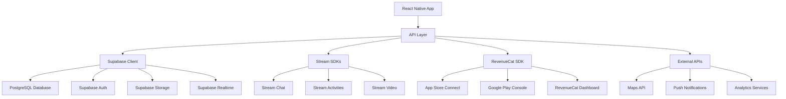

# API Integration Patterns

## Overview
The travel platform integrates with multiple APIs and services, each requiring specific patterns for optimal performance, security, and maintainability. This document outlines the integration patterns for all external services.

## Integration Architecture



## 1. Supabase Integration Patterns

### Client Configuration
```typescript
// src/services/supabase/client.ts
import { createClient, SupabaseClient } from '@supabase/supabase-js';
import { Database } from '@/src/types/database';

const supabaseUrl = process.env.EXPO_PUBLIC_SUPABASE_URL!;
const supabaseAnonKey = process.env.EXPO_PUBLIC_SUPABASE_ANON_KEY!;

export const supabase: SupabaseClient<Database> = createClient(
  supabaseUrl,
  supabaseAnonKey,
  {
    auth: {
      autoRefreshToken: true,
      persistSession: true,
      detectSessionInUrl: false,
    },
    realtime: {
      params: {
        eventsPerSecond: 10,
      },
    },
    global: {
      headers: {
        'x-application-name': 'travel-platform',
      },
    },
  }
);

// Enhanced error handling
export class SupabaseError extends Error {
  constructor(
    message: string,
    public code?: string,
    public details?: string,
    public hint?: string
  ) {
    super(message);
    this.name = 'SupabaseError';
  }
}

export const handleSupabaseError = (error: any): never => {
  throw new SupabaseError(
    error.message || 'An unknown error occurred',
    error.code,
    error.details,
    error.hint
  );
};
```

### Database Service Layer
```typescript
// src/services/supabase/database.ts
import { supabase, handleSupabaseError } from './client';
import type { 
  Listing, 
  CreateListingData, 
  UpdateListingData,
  ListingFilters 
} from '@/src/types';

export class DatabaseService {
  // Generic CRUD operations
  async findById<T>(
    table: string, 
    id: string, 
    select: string = '*'
  ): Promise<T> {
    const { data, error } = await supabase
      .from(table)
      .select(select)
      .eq('id', id)
      .single();

    if (error) handleSupabaseError(error);
    return data as T;
  }

  async findMany<T>(
    table: string,
    options: {
      select?: string;
      filters?: Record<string, any>;
      orderBy?: { column: string; ascending: boolean }[];
      limit?: number;
      offset?: number;
    } = {}
  ): Promise<T[]> {
    let query = supabase.from(table);

    if (options.select) {
      query = query.select(options.select);
    }

    if (options.filters) {
      Object.entries(options.filters).forEach(([key, value]) => {
        if (value !== undefined && value !== null) {
          query = query.eq(key, value);
        }
      });
    }

    if (options.orderBy) {
      options.orderBy.forEach(({ column, ascending }) => {
        query = query.order(column, { ascending });
      });
    }

    if (options.limit) {
      const from = options.offset || 0;
      const to = from + options.limit - 1;
      query = query.range(from, to);
    }

    const { data, error } = await query;
    if (error) handleSupabaseError(error);
    return data as T[];
  }

  async create<T>(
    table: string, 
    data: Omit<T, 'id' | 'created_at' | 'updated_at'>
  ): Promise<T> {
    const { data: result, error } = await supabase
      .from(table)
      .insert(data)
      .select()
      .single();

    if (error) handleSupabaseError(error);
    return result as T;
  }

  async update<T>(
    table: string, 
    id: string, 
    data: Partial<T>
  ): Promise<T> {
    const { data: result, error } = await supabase
      .from(table)
      .update({ ...data, updated_at: new Date().toISOString() })
      .eq('id', id)
      .select()
      .single();

    if (error) handleSupabaseError(error);
    return result as T;
  }

  async delete(table: string, id: string): Promise<void> {
    const { error } = await supabase
      .from(table)
      .delete()
      .eq('id', id);

    if (error) handleSupabaseError(error);
  }
}

export const db = new DatabaseService();

// Specific service classes
export class ListingsService extends DatabaseService {
  async getListings(filters: ListingFilters = {}): Promise<Listing[]> {
    let query = supabase
      .from('listings')
      .select(`
        *,
        host:user_profiles!listings_host_id_fkey(
          id, first_name, last_name, avatar_url, verification_status
        ),
        images,
        amenities
      `)
      .eq('status', 'active');

    // Apply location filter with PostGIS
    if (filters.location && filters.radius) {
      query = query.rpc('listings_within_radius', {
        lat: filters.location.latitude,
        lng: filters.location.longitude,
        radius_km: filters.radius
      });
    }

    // Apply price range filter
    if (filters.priceRange) {
      query = query
        .gte('base_price', filters.priceRange.min)
        .lte('base_price', filters.priceRange.max);
    }

    // Apply guest count filter
    if (filters.guests) {
      query = query.gte('max_guests', filters.guests);
    }

    // Apply date availability filter
    if (filters.checkIn && filters.checkOut) {
      query = query.rpc('check_availability', {
        listing_id: 'id',
        check_in: filters.checkIn,
        check_out: filters.checkOut
      });
    }

    // Apply amenities filter
    if (filters.amenities && filters.amenities.length > 0) {
      query = query.contains('amenities', filters.amenities);
    }

    // Apply sorting
    const sortOptions = {
      'price-low': { column: 'base_price', ascending: true },
      'price-high': { column: 'base_price', ascending: false },
      'rating': { column: 'average_rating', ascending: false },
      'newest': { column: 'created_at', ascending: false },
    };

    const sort = sortOptions[filters.sortBy || 'newest'];
    query = query.order(sort.column, { ascending: sort.ascending });

    const { data, error } = await query;
    if (error) handleSupabaseError(error);
    return data as Listing[];
  }

  async createListing(listingData: CreateListingData): Promise<Listing> {
    // Upload images first
    const imageUrls = await this.uploadListingImages(listingData.images);
    
    const { data, error } = await supabase
      .from('listings')
      .insert({
        ...listingData,
        images: imageUrls,
        status: 'draft'
      })
      .select()
      .single();

    if (error) handleSupabaseError(error);
    return data as Listing;
  }

  private async uploadListingImages(images: string[]): Promise<string[]> {
    const uploadPromises = images.map(async (imageUri, index) => {
      const fileName = `listing-${Date.now()}-${index}.jpg`;
      const { data, error } = await supabase.storage
        .from('listing-images')
        .upload(fileName, {
          uri: imageUri,
          type: 'image/jpeg',
          name: fileName,
        });

      if (error) throw error;
      
      const { data: { publicUrl } } = supabase.storage
        .from('listing-images')
        .getPublicUrl(data.path);

      return publicUrl;
    });

    return Promise.all(uploadPromises);
  }
}

export const listingsService = new ListingsService();
```

### Authentication Service
```typescript
// src/services/supabase/auth.ts
import { supabase, handleSupabaseError } from './client';
import type { SignInCredentials, SignUpCredentials } from '@/src/types';

export class AuthService {
  async signUp(credentials: SignUpCredentials) {
    const { data, error } = await supabase.auth.signUp({
      email: credentials.email,
      password: credentials.password,
      options: {
        data: {
          first_name: credentials.firstName,
          last_name: credentials.lastName,
          phone: credentials.phone,
        }
      }
    });

    if (error) handleSupabaseError(error);
    
    // Create user profile
    if (data.user) {
      await this.createUserProfile(data.user, credentials);
    }

    return data;
  }

  async signIn(credentials: SignInCredentials) {
    const { data, error } = await supabase.auth.signInWithPassword({
      email: credentials.email,
      password: credentials.password,
    });

    if (error) handleSupabaseError(error);
    return data;
  }

  async signOut() {
    const { error } = await supabase.auth.signOut();
    if (error) handleSupabaseError(error);
  }

  async resetPassword(email: string) {
    const { error } = await supabase.auth.resetPasswordForEmail(email, {
      redirectTo: 'myapp://reset-password',
    });

    if (error) handleSupabaseError(error);
  }

  async updatePassword(newPassword: string) {
    const { error } = await supabase.auth.updateUser({
      password: newPassword
    });

    if (error) handleSupabaseError(error);
  }

  private async createUserProfile(user: any, credentials: SignUpCredentials) {
    const { error } = await supabase
      .from('user_profiles')
      .insert({
        id: user.id,
        email: user.email,
        first_name: credentials.firstName,
        last_name: credentials.lastName,
        phone: credentials.phone,
        role: 'traveler',
        status: 'active',
        verification_status: 'unverified',
      });

    if (error) handleSupabaseError(error);
  }

  // Real-time auth state listener
  onAuthStateChange(callback: (event: string, session: any) => void) {
    return supabase.auth.onAuthStateChange(callback);
  }
}

export const authService = new AuthService();
```

### Real-time Subscriptions
```typescript
// src/services/supabase/realtime.ts
import { supabase } from './client';
import { RealtimeChannel } from '@supabase/supabase-js';

export class RealtimeService {
  private channels: Map<string, RealtimeChannel> = new Map();

  subscribeToBookings(userId: string, callback: (payload: any) => void) {
    const channelName = `bookings:${userId}`;
    
    if (this.channels.has(channelName)) {
      return this.channels.get(channelName)!;
    }

    const channel = supabase
      .channel(channelName)
      .on(
        'postgres_changes',
        {
          event: '*',
          schema: 'public',
          table: 'bookings',
          filter: `guest_id=eq.${userId}`,
        },
        callback
      )
      .on(
        'postgres_changes',
        {
          event: '*',
          schema: 'public',
          table: 'bookings',
          filter: `host_id=eq.${userId}`,
        },
        callback
      )
      .subscribe();

    this.channels.set(channelName, channel);
    return channel;
  }

  subscribeToMessages(userId: string, callback: (payload: any) => void) {
    const channelName = `messages:${userId}`;
    
    const channel = supabase
      .channel(channelName)
      .on(
        'postgres_changes',
        {
          event: 'INSERT',
          schema: 'public',
          table: 'message_threads',
          filter: `${userId}=any(participants)`,
        },
        callback
      )
      .subscribe();

    this.channels.set(channelName, channel);
    return channel;
  }

  unsubscribe(channelName: string) {
    const channel = this.channels.get(channelName);
    if (channel) {
      supabase.removeChannel(channel);
      this.channels.delete(channelName);
    }
  }

  unsubscribeAll() {
    this.channels.forEach((channel, name) => {
      supabase.removeChannel(channel);
    });
    this.channels.clear();
  }
}

export const realtimeService = new RealtimeService();
```

## 2. Stream Integration Patterns

### Chat Service
```typescript
// src/services/stream/chat-service.ts
import { StreamChat, Channel, ChannelType } from 'stream-chat';
import { chatClient } from './clients';

export class ChatService {
  async connectUser(user: User, token: string) {
    await chatClient.connectUser(
      {
        id: user.id,
        name: `${user.first_name} ${user.last_name}`,
        image: user.avatar_url,
        role: user.role,
      },
      token
    );
  }

  async disconnectUser() {
    await chatClient.disconnectUser();
  }

  async createChannel(
    type: ChannelType,
    members: string[],
    data?: {
      name?: string;
      image?: string;
      booking_id?: string;
      listing_id?: string;
    }
  ): Promise<Channel> {
    const channel = chatClient.channel(type, {
      members,
      ...data,
    });

    await channel.create();
    return channel;
  }

  async getOrCreateDirectMessage(userId: string, otherUserId: string): Promise<Channel> {
    const channelId = [userId, otherUserId].sort().join('-');
    
    const channel = chatClient.channel('messaging', channelId, {
      members: [userId, otherUserId],
    });

    await channel.create();
    return channel;
  }

  async getUserChannels(userId: string): Promise<Channel[]> {
    const filter = { members: { $in: [userId] } };
    const sort = { last_message_at: -1 };
    
    const { channels } = await chatClient.queryChannels(filter, sort, {
      watch: true,
      presence: true,
    });

    return channels;
  }

  async markChannelRead(channelId: string) {
    const channel = chatClient.channel('messaging', channelId);
    await channel.markRead();
  }

  // Message reactions
  async addReaction(channelId: string, messageId: string, type: string) {
    const channel = chatClient.channel('messaging', channelId);
    await channel.sendReaction(messageId, { type });
  }

  async removeReaction(channelId: string, messageId: string, type: string) {
    const channel = chatClient.channel('messaging', channelId);
    await channel.deleteReaction(messageId, type);
  }

  // File uploads
  async uploadFile(channelId: string, file: any): Promise<string> {
    const channel = chatClient.channel('messaging', channelId);
    const response = await channel.sendFile(file);
    return response.file;
  }

  // Typing indicators
  async startTyping(channelId: string) {
    const channel = chatClient.channel('messaging', channelId);
    await channel.keystroke();
  }

  async stopTyping(channelId: string) {
    const channel = chatClient.channel('messaging', channelId);
    await channel.stopTyping();
  }
}

export const chatService = new ChatService();
```

### Video Service
```typescript
// src/services/stream/video-service.ts
import { StreamVideoClient, Call } from '@stream-io/video-react-native-sdk';

export class VideoService {
  private client: StreamVideoClient;

  constructor(client: StreamVideoClient) {
    this.client = client;
  }

  async createCall(callId: string, members: string[]): Promise<Call> {
    const call = this.client.call('default', callId);
    
    await call.getOrCreate({
      data: {
        members: members.map(id => ({ user_id: id })),
        settings_override: {
          audio: { default_device: 'speaker' },
          video: { camera_default_on: true },
        },
      },
    });

    return call;
  }

  async joinCall(callId: string): Promise<Call> {
    const call = this.client.call('default', callId);
    await call.join();
    return call;
  }

  async leaveCall(callId: string) {
    const call = this.client.call('default', callId);
    await call.leave();
  }

  async toggleAudio(callId: string) {
    const call = this.client.call('default', callId);
    await call.microphone.toggle();
  }

  async toggleVideo(callId: string) {
    const call = this.client.call('default', callId);
    await call.camera.toggle();
  }

  async switchCamera(callId: string) {
    const call = this.client.call('default', callId);
    await call.camera.flip();
  }
}

export const videoService = new VideoService(videoClient);
```

## 3. RevenueCat Integration Patterns

### Subscription Service
```typescript
// src/services/revenuecat/subscription-service.ts
import Purchases, { 
  CustomerInfo, 
  PurchasesOfferings, 
  PurchasesStoreProduct 
} from 'react-native-purchases';

export class SubscriptionService {
  async initialize(userId: string) {
    await Purchases.logIn(userId);
    
    // Configure RevenueCat
    Purchases.setLogLevel('DEBUG');
    
    // Set user attributes
    const userAttributes = {
      '$email': await this.getUserEmail(),
      '$displayName': await this.getUserDisplayName(),
    };
    
    await Purchases.setAttributes(userAttributes);
  }

  async getOfferings(): Promise<PurchasesOfferings> {
    return await Purchases.getOfferings();
  }

  async purchaseProduct(product: PurchasesStoreProduct): Promise<CustomerInfo> {
    const { customerInfo } = await Purchases.purchaseStoreProduct(product);
    
    // Sync with backend
    await this.syncSubscriptionWithBackend(customerInfo);
    
    return customerInfo;
  }

  async restorePurchases(): Promise<CustomerInfo> {
    return await Purchases.restorePurchases();
  }

  async getCustomerInfo(): Promise<CustomerInfo> {
    return await Purchases.getCustomerInfo();
  }

  async hasActiveSubscription(): Promise<boolean> {
    const customerInfo = await this.getCustomerInfo();
    return Object.keys(customerInfo.entitlements.active).length > 0;
  }

  async hasFeatureAccess(featureId: string): Promise<boolean> {
    const customerInfo = await this.getCustomerInfo();
    const entitlement = customerInfo.entitlements.active[featureId];
    return entitlement?.isActive || false;
  }

  async checkTrialEligibility(productId: string): Promise<boolean> {
    const customerInfo = await this.getCustomerInfo();
    return !customerInfo.entitlements.all[productId]?.willRenew;
  }

  private async syncSubscriptionWithBackend(customerInfo: CustomerInfo) {
    const activeSubscriptions = Object.values(customerInfo.entitlements.active)
      .map(entitlement => ({
        product_id: entitlement.productIdentifier,
        expires_at: entitlement.expirationDate,
        is_active: entitlement.isActive,
        will_renew: entitlement.willRenew,
      }));

    await supabase
      .from('subscriptions')
      .upsert({
        user_id: customerInfo.originalAppUserId,
        revenue_cat_subscription_id: customerInfo.originalAppUserId,
        active_subscriptions: activeSubscriptions,
        updated_at: new Date().toISOString(),
      });
  }

  // Subscription lifecycle events
  onSubscriptionUpdated(callback: (customerInfo: CustomerInfo) => void) {
    Purchases.addCustomerInfoUpdateListener(callback);
  }

  removeSubscriptionListener() {
    Purchases.removeCustomerInfoUpdateListener();
  }

  private async getUserEmail(): Promise<string> {
    const { data: { user } } = await supabase.auth.getUser();
    return user?.email || '';
  }

  private async getUserDisplayName(): Promise<string> {
    const { data: profile } = await supabase
      .from('user_profiles')
      .select('first_name, last_name')
      .single();
    
    return `${profile?.first_name} ${profile?.last_name}` || '';
  }
}

export const subscriptionService = new SubscriptionService();
```

## 4. Error Handling Patterns

### Global Error Handler
```typescript
// src/utils/error-handler.ts
import { SupabaseError } from '@/src/services/supabase/client';
import * as Sentry from '@sentry/react-native';

export enum ErrorType {
  NETWORK = 'NETWORK',
  AUTHENTICATION = 'AUTHENTICATION',
  PERMISSION = 'PERMISSION',
  VALIDATION = 'VALIDATION',
  SERVER = 'SERVER',
  UNKNOWN = 'UNKNOWN',
}

export class AppError extends Error {
  constructor(
    message: string,
    public type: ErrorType,
    public originalError?: Error,
    public userMessage?: string
  ) {
    super(message);
    this.name = 'AppError';
  }
}

export const handleError = (error: Error | SupabaseError | any): AppError => {
  let appError: AppError;

  if (error instanceof SupabaseError) {
    appError = handleSupabaseError(error);
  } else if (error.name === 'NetworkError') {
    appError = new AppError(
      'Network connection failed',
      ErrorType.NETWORK,
      error,
      'Please check your internet connection and try again.'
    );
  } else if (error.message?.includes('JWT')) {
    appError = new AppError(
      'Authentication expired',
      ErrorType.AUTHENTICATION,
      error,
      'Please sign in again.'
    );
  } else {
    appError = new AppError(
      error.message || 'An unexpected error occurred',
      ErrorType.UNKNOWN,
      error,
      'Something went wrong. Please try again.'
    );
  }

  // Log to Sentry
  Sentry.captureException(appError);

  return appError;
};

const handleSupabaseError = (error: SupabaseError): AppError => {
  switch (error.code) {
    case 'PGRST116':
      return new AppError(
        'Resource not found',
        ErrorType.VALIDATION,
        error,
        'The requested item was not found.'
      );
    case 'PGRST301':
      return new AppError(
        'Insufficient permissions',
        ErrorType.PERMISSION,
        error,
        'You do not have permission to perform this action.'
      );
    case '23505':
      return new AppError(
        'Duplicate entry',
        ErrorType.VALIDATION,
        error,
        'This item already exists.'
      );
    default:
      return new AppError(
        error.message,
        ErrorType.SERVER,
        error,
        'A server error occurred. Please try again.'
      );
  }
};
```

### React Query Error Handling
```typescript
// src/hooks/use-error-handling.ts
import { useMutation, useQueryClient } from '@tanstack/react-query';
import { handleError, AppError } from '@/src/utils/error-handler';

export const useErrorHandling = () => {
  const showError = (error: AppError) => {
    // Show user-friendly error message
    // This could be a toast, alert, or error banner
    console.error('App Error:', error);
  };

  const handleQueryError = (error: Error) => {
    const appError = handleError(error);
    showError(appError);
    return appError;
  };

  return { handleQueryError, showError };
};

// Enhanced mutation hook with error handling
export const useMutationWithErrorHandling = <TData, TError, TVariables>(
  mutationFn: (variables: TVariables) => Promise<TData>,
  options: {
    onSuccess?: (data: TData) => void;
    onError?: (error: AppError) => void;
    showErrorToast?: boolean;
  } = {}
) => {
  const { handleQueryError } = useErrorHandling();
  const queryClient = useQueryClient();

  return useMutation({
    mutationFn,
    onError: (error: Error) => {
      const appError = handleQueryError(error);
      options.onError?.(appError);
    },
    onSuccess: options.onSuccess,
    onSettled: () => {
      // Optional: Invalidate queries after mutation
      queryClient.invalidateQueries();
    },
  });
};
```

## 5. Caching & Offline Support

### Cache Configuration
```typescript
// src/utils/cache-config.ts
export const CACHE_TIMES = {
  SHORT: 1000 * 60 * 5,        // 5 minutes
  MEDIUM: 1000 * 60 * 30,      // 30 minutes  
  LONG: 1000 * 60 * 60 * 2,    // 2 hours
  VERY_LONG: 1000 * 60 * 60 * 24, // 24 hours
};

export const STALE_TIMES = {
  SHORT: 1000 * 30,            // 30 seconds
  MEDIUM: 1000 * 60 * 2,       // 2 minutes
  LONG: 1000 * 60 * 10,        // 10 minutes
  VERY_LONG: 1000 * 60 * 60,   // 1 hour
};

export const getCacheConfig = (type: 'listings' | 'user' | 'bookings' | 'messages') => {
  switch (type) {
    case 'listings':
      return {
        staleTime: STALE_TIMES.MEDIUM,
        cacheTime: CACHE_TIMES.LONG,
      };
    case 'user':
      return {
        staleTime: STALE_TIMES.LONG,
        cacheTime: CACHE_TIMES.VERY_LONG,
      };
    case 'bookings':
      return {
        staleTime: STALE_TIMES.SHORT,
        cacheTime: CACHE_TIMES.MEDIUM,
      };
    case 'messages':
      return {
        staleTime: 0, // Always fetch fresh
        cacheTime: CACHE_TIMES.SHORT,
      };
    default:
      return {
        staleTime: STALE_TIMES.MEDIUM,
        cacheTime: CACHE_TIMES.MEDIUM,
      };
  }
};
```

### Offline Detection
```typescript
// src/utils/network-status.ts
import NetInfo from '@react-native-community/netinfo';
import { create } from 'zustand';

interface NetworkState {
  isConnected: boolean;
  isInternetReachable: boolean;
  type: string;
  setNetworkState: (state: Partial<NetworkState>) => void;
}

export const useNetworkStore = create<NetworkState>((set) => ({
  isConnected: true,
  isInternetReachable: true,
  type: 'wifi',
  setNetworkState: (newState) => set(newState),
}));

export const initializeNetworkMonitoring = () => {
  const unsubscribe = NetInfo.addEventListener(state => {
    useNetworkStore.getState().setNetworkState({
      isConnected: state.isConnected ?? false,
      isInternetReachable: state.isInternetReachable ?? false,
      type: state.type,
    });
  });

  return unsubscribe;
};

// Hook for offline-aware queries
export const useOfflineQuery = <T>(
  queryKey: any[],
  queryFn: () => Promise<T>,
  options: any = {}
) => {
  const { isConnected } = useNetworkStore();
  
  return useQuery({
    queryKey,
    queryFn,
    enabled: isConnected,
    networkMode: 'offlineFirst',
    ...options,
  });
};
```

This API integration architecture provides:
- **Unified Error Handling**: Consistent error patterns across all services
- **Type Safety**: Full TypeScript support for all API interactions
- **Offline Support**: Smart caching and offline-first strategies
- **Performance Optimized**: Efficient caching and query strategies
- **Scalable Architecture**: Easy to extend with new services
- **Developer Experience**: Clear patterns and debugging support
- **Security First**: Proper authentication and authorization patterns