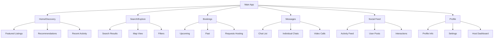
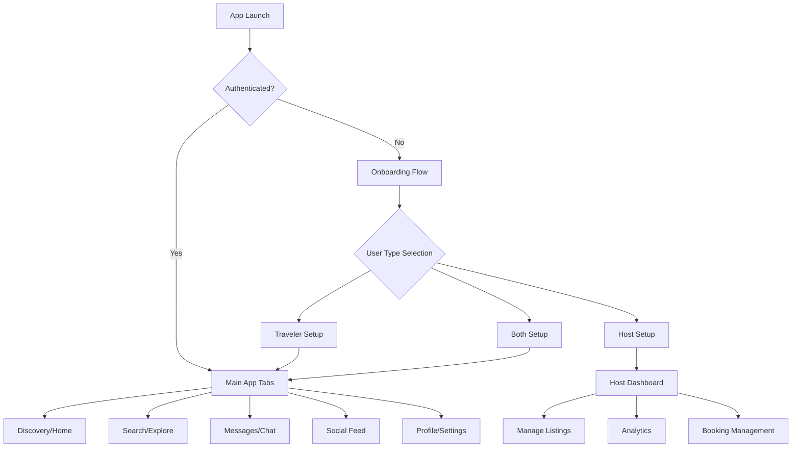
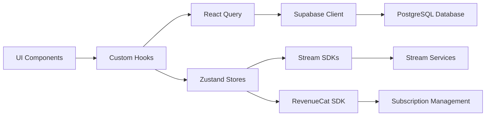

# Travel Platform Architecture

## Overview
A comprehensive React Native/Expo travel platform with multi-user support, featuring accommodations, experiences, social interactions, and subscription-based memberships.

## Technology Stack
- **Frontend**: React Native with Expo (TypeScript)
- **Backend**: Supabase (PostgreSQL, Auth, Real-time, Storage)
- **Payments/Subscriptions**: RevenueCat
- **Chat/Social/Calls**: Stream (Chat, Activity Feeds, Video)
- **State Management**: Zustand + React Query
- **Navigation**: Expo Router (file-based routing)
- **UI/Styling**: Custom theming system + NativeWind (optional)

## Current Project Assets (Reusable)
- ✅ Theming system with light/dark mode
- ✅ Tab-based navigation structure
- ✅ Reusable components (ThemedText, ThemedView, etc.)
- ✅ Animation support (react-native-reanimated)
- ✅ TypeScript setup
- ✅ Expo Router configuration

## Proposed Folder Structure

```
/Users/apple/MyNewTravelProject/
├── app/                              # Expo Router pages
│   ├── _layout.tsx                   # Root layout (existing)
│   ├── +not-found.tsx               # 404 page
│   ├── (auth)/                       # Authentication group
│   │   ├── _layout.tsx
│   │   ├── sign-in.tsx
│   │   ├── sign-up.tsx
│   │   └── forgot-password.tsx
│   ├── (onboarding)/                 # First-time user flow
│   │   ├── _layout.tsx
│   │   ├── welcome.tsx
│   │   ├── user-type.tsx
│   │   └── profile-setup.tsx
│   ├── (tabs)/                       # Main app tabs (existing structure)
│   │   ├── _layout.tsx               # Enhanced with more tabs
│   │   ├── index.tsx                 # Home/Discovery
│   │   ├── explore.tsx               # Search & Filters
│   │   ├── bookings.tsx              # User bookings
│   │   ├── messages.tsx              # Chat interface
│   │   ├── social.tsx                # Social feed
│   │   └── profile.tsx               # User profile
│   ├── (host)/                       # Host-specific screens
│   │   ├── _layout.tsx
│   │   ├── dashboard.tsx
│   │   ├── listings/
│   │   │   ├── index.tsx
│   │   │   ├── create.tsx
│   │   │   └── [id]/
│   │   │       ├── edit.tsx
│   │   │       └── analytics.tsx
│   │   └── bookings.tsx
│   ├── listing/                      # Listing details
│   │   └── [id].tsx
│   ├── booking/                      # Booking flow
│   │   ├── [id]/
│   │   │   ├── details.tsx
│   │   │   ├── payment.tsx
│   │   │   └── confirmation.tsx
│   ├── chat/                         # Chat screens
│   │   ├── [channelId].tsx
│   │   └── video-call/[callId].tsx
│   ├── profile/                      # Profile screens
│   │   ├── [userId].tsx
│   │   ├── edit.tsx
│   │   └── settings.tsx
│   ├── subscription/                 # RevenueCat screens
│   │   ├── plans.tsx
│   │   └── manage.tsx
│   └── modal.tsx                     # Enhanced modal (existing)
├── src/                              # Core application code
│   ├── components/                   # Reusable UI components
│   │   ├── ui/                       # Basic UI elements (existing + enhanced)
│   │   │   ├── button.tsx
│   │   │   ├── input.tsx
│   │   │   ├── card.tsx
│   │   │   ├── avatar.tsx
│   │   │   ├── badge.tsx
│   │   │   └── modal.tsx
│   │   ├── forms/                    # Form components
│   │   │   ├── auth-form.tsx
│   │   │   ├── listing-form.tsx
│   │   │   └── booking-form.tsx
│   │   ├── listings/                 # Listing-related components
│   │   │   ├── listing-card.tsx
│   │   │   ├── listing-grid.tsx
│   │   │   ├── listing-filters.tsx
│   │   │   └── listing-map.tsx
│   │   ├── chat/                     # Stream Chat components
│   │   │   ├── message-list.tsx
│   │   │   ├── message-input.tsx
│   │   │   └── call-controls.tsx
│   │   ├── social/                   # Social feed components
│   │   │   ├── post-card.tsx
│   │   │   ├── activity-feed.tsx
│   │   │   └── user-interactions.tsx
│   │   └── booking/                  # Booking components
│   │       ├── booking-summary.tsx
│   │       ├── payment-form.tsx
│   │       └── booking-status.tsx
│   ├── services/                     # External service integrations
│   │   ├── supabase/
│   │   │   ├── client.ts
│   │   │   ├── auth.ts
│   │   │   ├── database.ts
│   │   │   └── storage.ts
│   │   ├── stream/
│   │   │   ├── chat-client.ts
│   │   │   ├── activity-client.ts
│   │   │   └── video-client.ts
│   │   ├── revenuecat/
│   │   │   ├── client.ts
│   │   │   └── subscriptions.ts
│   │   └── notifications/
│   │       └── expo-notifications.ts
│   ├── stores/                       # Zustand state stores
│   │   ├── auth-store.ts
│   │   ├── user-store.ts
│   │   ├── listings-store.ts
│   │   ├── bookings-store.ts
│   │   ├── chat-store.ts
│   │   └── subscription-store.ts
│   ├── hooks/                        # Custom hooks (enhance existing)
│   │   ├── use-auth.ts
│   │   ├── use-supabase.ts
│   │   ├── use-stream.ts
│   │   ├── use-subscription.ts
│   │   └── queries/                  # React Query hooks
│   │       ├── use-listings.ts
│   │       ├── use-bookings.ts
│   │       ├── use-users.ts
│   │       └── use-messages.ts
│   ├── types/                        # TypeScript type definitions
│   │   ├── database.ts               # Supabase generated types
│   │   ├── user.ts
│   │   ├── listing.ts
│   │   ├── booking.ts
│   │   ├── message.ts
│   │   └── subscription.ts
│   ├── utils/                        # Utility functions
│   │   ├── validation.ts
│   │   ├── formatting.ts
│   │   ├── permissions.ts
│   │   └── constants.ts
│   └── lib/                          # Third-party configurations
│       ├── react-query.ts
│       ├── expo-router.ts
│       └── error-boundary.tsx
├── assets/                           # Static assets (existing structure)
├── components/                       # Keep existing components, gradually migrate
└── constants/                        # Keep existing constants (enhanced)
```

## Navigation Architecture

### Tab Structure (Enhanced)


### User Flow Architecture


## Key Architectural Decisions

### 1. **Hybrid Navigation Approach**
- Keep existing tab structure but enhance with more tabs
- Use groups for authentication, onboarding, and host-specific flows
- Implement modal overlays for booking flows and detailed interactions

### 2. **State Management Strategy**
- **Zustand**: Lightweight global state for user auth, preferences
- **React Query**: Server state management, caching, synchronization
- **Stream State**: Chat and social feed state managed by Stream SDK
- **Local State**: Component-specific state with React hooks

### 3. **Component Architecture**
- Maintain existing theming system (ThemedText, ThemedView)
- Build new components following the same patterns
- Create feature-specific component groups (listings, chat, social)
- Implement progressive enhancement of existing components

### 4. **Data Flow Architecture**


This architecture leverages your existing Expo/React Native foundation while adding the comprehensive features needed for a travel platform. The structure maintains backward compatibility with your current setup while providing clear paths for implementing all required features.