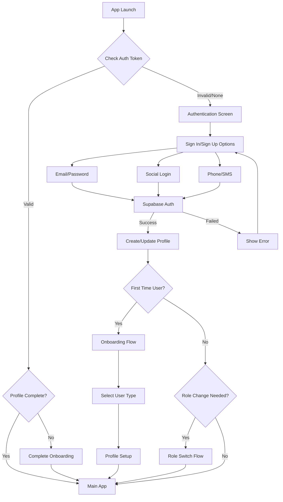
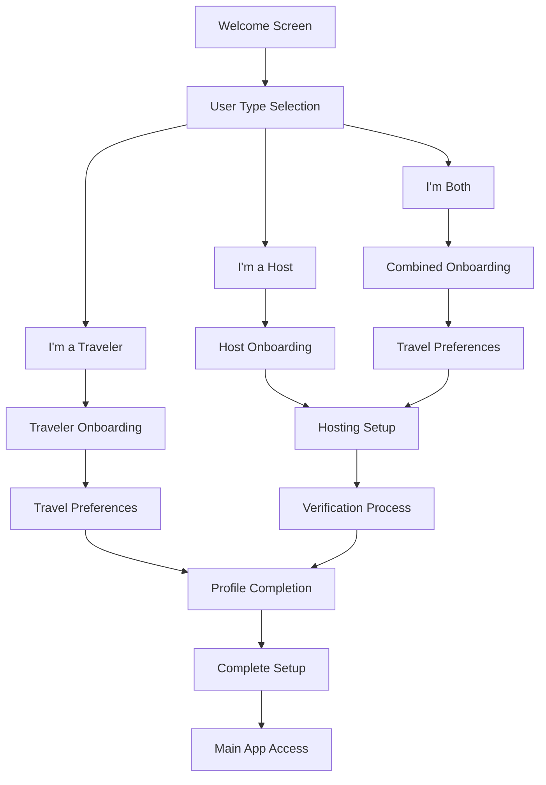
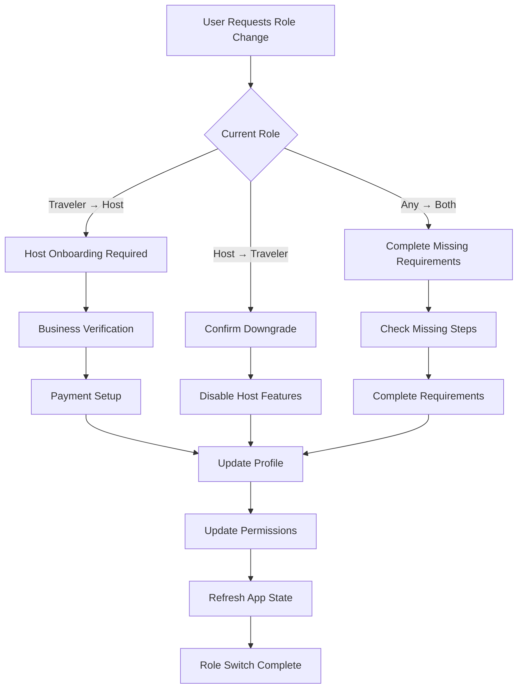

# Authentication & User Role Management System

## Overview
The travel platform implements a comprehensive authentication system using Supabase Auth with role-based access control, supporting multiple user types and seamless role switching.

## Authentication Flow

### 1. Initial App Launch Flow


### 2. Authentication States
```typescript
type AuthState = {
  user: User | null;
  profile: UserProfile | null;
  session: Session | null;
  loading: boolean;
  error: string | null;
  isOnboarding: boolean;
  pendingRoleChange: UserRole | null;
};

type AuthStatus = 
  | 'unauthenticated'
  | 'authenticated'
  | 'onboarding'
  | 'role_switching'
  | 'loading';
```

## User Role Management

### 1. Role Definitions
```typescript
enum UserRole {
  TRAVELER = 'traveler',      // Can book accommodations/experiences
  HOST = 'host',              // Can list accommodations/experiences
  BOTH = 'both',              // Full platform access
  ADMIN = 'admin'             // Administrative access
}

interface UserPermissions {
  // Booking permissions
  canBook: boolean;
  canCancelBooking: boolean;
  canReviewBookings: boolean;
  
  // Hosting permissions
  canCreateListings: boolean;
  canManageListings: boolean;
  canAcceptBookings: boolean;
  canAccessHostAnalytics: boolean;
  
  // Social permissions
  canPost: boolean;
  canComment: boolean;
  canMessage: boolean;
  canVideoCall: boolean;
  
  // Subscription features
  hasAdvancedFilters: boolean;
  hasUnlimitedMessages: boolean;
  hasVideoCallAccess: boolean;
  hasPrioritySupport: boolean;
  
  // Administrative
  canModerateContent: boolean;
  canManageUsers: boolean;
  canAccessAnalytics: boolean;
}
```

### 2. Permission Matrix
```typescript
const ROLE_PERMISSIONS: Record<UserRole, UserPermissions> = {
  [UserRole.TRAVELER]: {
    canBook: true,
    canCancelBooking: true,
    canReviewBookings: true,
    canCreateListings: false,
    canManageListings: false,
    canAcceptBookings: false,
    canAccessHostAnalytics: false,
    canPost: true,
    canComment: true,
    canMessage: true,
    canVideoCall: false, // Requires subscription
    hasAdvancedFilters: false,
    hasUnlimitedMessages: false,
    hasVideoCallAccess: false,
    hasPrioritySupport: false,
    canModerateContent: false,
    canManageUsers: false,
    canAccessAnalytics: false,
  },
  [UserRole.HOST]: {
    canBook: false,
    canCancelBooking: false,
    canReviewBookings: false,
    canCreateListings: true,
    canManageListings: true,
    canAcceptBookings: true,
    canAccessHostAnalytics: true,
    canPost: true,
    canComment: true,
    canMessage: true,
    canVideoCall: true,
    hasAdvancedFilters: true,
    hasUnlimitedMessages: true,
    hasVideoCallAccess: true,
    hasPrioritySupport: true,
    canModerateContent: false,
    canManageUsers: false,
    canAccessAnalytics: false,
  },
  [UserRole.BOTH]: {
    // All permissions enabled
    canBook: true,
    canCancelBooking: true,
    canReviewBookings: true,
    canCreateListings: true,
    canManageListings: true,
    canAcceptBookings: true,
    canAccessHostAnalytics: true,
    canPost: true,
    canComment: true,
    canMessage: true,
    canVideoCall: true,
    hasAdvancedFilters: true,
    hasUnlimitedMessages: true,
    hasVideoCallAccess: true,
    hasPrioritySupport: true,
    canModerateContent: false,
    canManageUsers: false,
    canAccessAnalytics: false,
  },
  [UserRole.ADMIN]: {
    // All permissions + administrative
    // ... (all true)
  }
};
```

## Onboarding Flow

### 1. User Type Selection


### 2. Profile Setup Requirements
```typescript
interface OnboardingSteps {
  traveler: {
    personalInfo: boolean;        // Name, photo, bio
    travelPreferences: boolean;   // Interests, budget range
    verification: boolean;        // Email/phone verification
  };
  host: {
    personalInfo: boolean;        // Name, photo, bio
    businessInfo: boolean;        // Business type, experience
    verification: boolean;        // Identity + business verification
    paymentSetup: boolean;        // Payment account setup
    firstListing: boolean;        // At least one listing created
  };
  both: {
    personalInfo: boolean;
    travelPreferences: boolean;
    businessInfo: boolean;
    verification: boolean;
    paymentSetup: boolean;
  };
}
```

## Role Switching System

### 1. Role Switch Flow


### 2. Role Switch Validation
```typescript
interface RoleSwitchValidation {
  fromRole: UserRole;
  toRole: UserRole;
  requiredSteps: string[];
  canSwitch: boolean;
  warnings: string[];
}

const validateRoleSwitch = (
  currentRole: UserRole, 
  targetRole: UserRole, 
  userProfile: UserProfile
): RoleSwitchValidation => {
  // Validation logic for role switching
  // Check verification status, payment setup, etc.
};
```

## Authentication Hooks & State Management

### 1. Auth Hook Implementation
```typescript
// src/hooks/use-auth.ts
interface UseAuthReturn {
  // State
  user: User | null;
  profile: UserProfile | null;
  session: Session | null;
  permissions: UserPermissions;
  isLoading: boolean;
  isOnboarding: boolean;
  
  // Actions
  signIn: (credentials: SignInCredentials) => Promise<void>;
  signUp: (credentials: SignUpCredentials) => Promise<void>;
  signOut: () => Promise<void>;
  updateProfile: (updates: Partial<UserProfile>) => Promise<void>;
  switchRole: (newRole: UserRole) => Promise<void>;
  completeOnboarding: (onboardingData: OnboardingData) => Promise<void>;
  
  // Utilities
  hasPermission: (permission: keyof UserPermissions) => boolean;
  requiresSubscription: (feature: string) => boolean;
  canAccessFeature: (feature: string) => boolean;
}

export const useAuth = (): UseAuthReturn => {
  // Implementation using Zustand + Supabase Auth
};
```

### 2. Permission Checking System
```typescript
// Permission checking utilities
export const usePermissions = () => {
  const { permissions, profile } = useAuth();
  
  const canAccess = useCallback((feature: string) => {
    // Check role permissions
    if (!permissions[feature]) return false;
    
    // Check subscription requirements
    if (requiresSubscription(feature) && !hasActiveSubscription()) {
      return false;
    }
    
    // Check verification requirements
    if (requiresVerification(feature) && !isVerified()) {
      return false;
    }
    
    return true;
  }, [permissions, profile]);
  
  return { canAccess, permissions };
};

// Route protection
export const useProtectedRoute = (requiredRole?: UserRole) => {
  const { user, profile, isLoading } = useAuth();
  const router = useRouter();
  
  useEffect(() => {
    if (!isLoading && !user) {
      router.replace('/auth/sign-in');
      return;
    }
    
    if (!isLoading && requiredRole && profile?.role !== requiredRole) {
      router.replace('/unauthorized');
      return;
    }
  }, [user, profile, isLoading, requiredRole]);
  
  return { isAuthorized: !!user && (!requiredRole || profile?.role === requiredRole) };
};
```

## Security Considerations

### 1. Row Level Security (RLS) Policies
```sql
-- Users can only read/update their own profile
CREATE POLICY "Users can view own profile" ON public.user_profiles
  FOR SELECT USING (auth.uid() = id);

CREATE POLICY "Users can update own profile" ON public.user_profiles
  FOR UPDATE USING (auth.uid() = id);

-- Listings visibility based on status and ownership
CREATE POLICY "Public can view active listings" ON public.listings
  FOR SELECT USING (status = 'active');

CREATE POLICY "Hosts can manage own listings" ON public.listings
  FOR ALL USING (auth.uid() = host_id);

-- Bookings privacy
CREATE POLICY "Users can view own bookings" ON public.bookings
  FOR SELECT USING (
    auth.uid() = guest_id OR 
    auth.uid() = host_id
  );
```

### 2. API Security
```typescript
// Middleware for role checking
export const requireRole = (allowedRoles: UserRole[]) => {
  return (req: Request, res: Response, next: NextFunction) => {
    const userRole = req.user?.role;
    
    if (!userRole || !allowedRoles.includes(userRole)) {
      return res.status(403).json({ error: 'Insufficient permissions' });
    }
    
    next();
  };
};

// Rate limiting for authentication endpoints
export const authRateLimit = rateLimit({
  windowMs: 15 * 60 * 1000, // 15 minutes
  max: 5, // 5 attempts per window
  message: 'Too many authentication attempts'
});
```

## Integration with Third-Party Services

### 1. Stream Integration
```typescript
// Initialize Stream user token when user authenticates
const initializeStreamUser = async (userId: string, userProfile: UserProfile) => {
  const streamToken = await streamClient.createUserToken(userId);
  
  await supabase
    .from('user_profiles')
    .update({ stream_user_token: streamToken })
    .eq('id', userId);
  
  return streamToken;
};
```

### 2. RevenueCat Integration
```typescript
// Link user to RevenueCat when they sign up
const initializeRevenueCatUser = async (userId: string, email: string) => {
  await Purchases.logIn(userId);
  await Purchases.setEmail(email);
  
  // Store RevenueCat customer ID
  const customerInfo = await Purchases.getCustomerInfo();
  
  await supabase
    .from('user_profiles')
    .update({ revenue_cat_id: customerInfo.originalAppUserId })
    .eq('id', userId);
};
```

This authentication system provides:
- **Secure Authentication**: Leveraging Supabase Auth with proper security policies
- **Flexible Role Management**: Easy switching between user types
- **Comprehensive Permissions**: Fine-grained access control
- **Smooth Onboarding**: Tailored flows for different user types
- **Third-party Integration**: Seamless connection with Stream and RevenueCat
- **Security First**: RLS policies and proper access controls