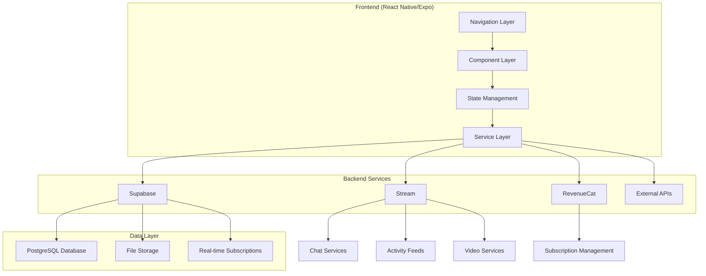
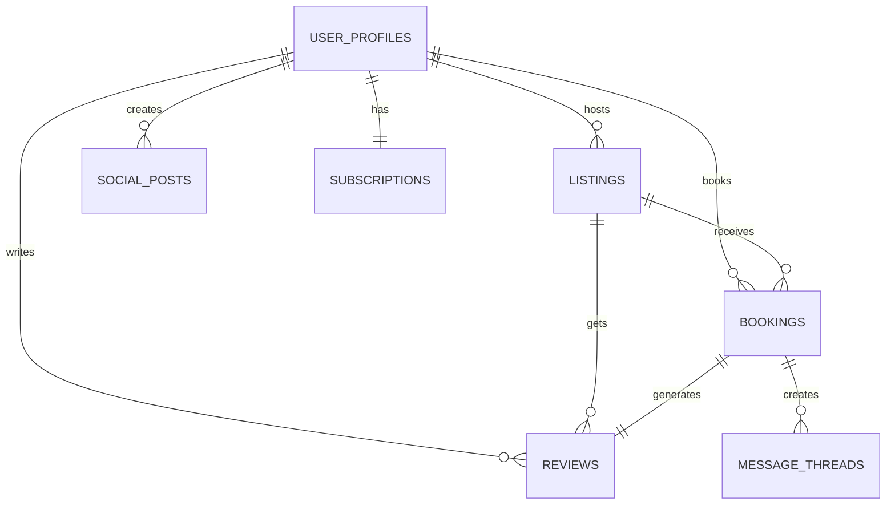
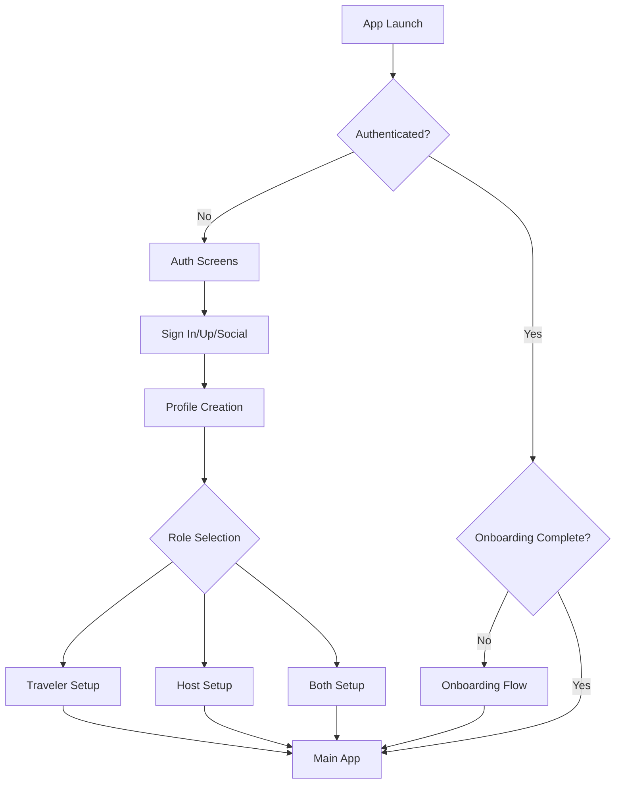
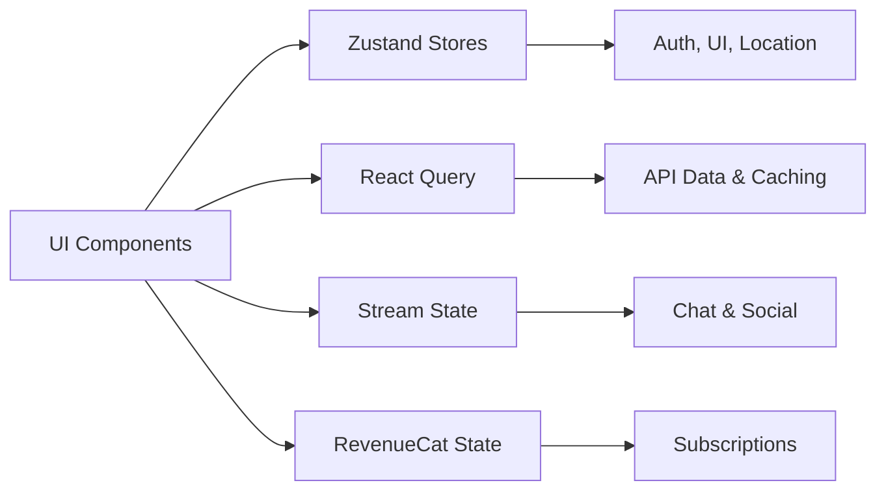

# Comprehensive Travel Platform Architecture

## Executive Summary

This document presents a complete architectural design for transforming your existing React Native/Expo project into a comprehensive travel platform. The architecture leverages modern technologies including Supabase for backend services, Stream for real-time communication, and RevenueCat for subscription management, while building upon your current foundation.

## Project Context

**Current State**: 
- React Native/Expo app with TypeScript
- Tab-based navigation (Home, Explore)
- Basic theming system with light/dark mode
- Foundational UI components

**Target State**: 
- Full-featured travel platform supporting multiple user types
- Comprehensive booking and hosting system
- Real-time chat and video calling
- Social features and community building
- Subscription-based monetization

## Architecture Overview



## Core Features & User Types

### User Types
1. **Travelers**: Browse, book, and review accommodations/experiences
2. **Hosts/Entrepreneurs**: List and manage accommodations/experiences/services
3. **Both**: Full access to traveler and host features
4. **Admin**: Platform management and moderation

### Feature Set
- **Authentication & Profiles**: Multi-role user management with verification
- **Listing Management**: Create, manage accommodations, experiences, and services
- **Search & Discovery**: Advanced filtering with location-based search
- **Booking System**: Complete reservation flow with payment processing
- **Communication**: Real-time chat with voice and video calling
- **Social Features**: Activity feeds, posts, likes, comments, and user interactions
- **Reviews & Ratings**: Comprehensive review system for trust building
- **Subscriptions**: Tiered membership with premium features
- **Host Tools**: Analytics dashboard and business management tools

## Technical Foundation

### Technology Stack
```yaml
Frontend:
  - React Native: 0.81.4
  - Expo: ~54.0.8
  - TypeScript: ~5.9.2
  - Expo Router: File-based navigation

Backend Services:
  - Supabase: Database, Auth, Storage, Realtime
  - Stream: Chat, Activity Feeds, Video calling
  - RevenueCat: Subscription management

State Management:
  - Zustand: Client state management
  - React Query: Server state & caching
  - Stream SDKs: Real-time state

Additional Services:
  - Expo Location & Maps: Location services
  - Expo Notifications: Push notifications
  - Sentry: Error tracking and monitoring
```

### Project Structure Enhancement
```
/Users/apple/MyNewTravelProject/
├── app/                              # Expo Router (Enhanced)
│   ├── (auth)/                       # Authentication flows
│   ├── (onboarding)/                 # User onboarding
│   ├── (tabs)/                       # Main app navigation
│   ├── (host)/                       # Host-specific screens
│   ├── (modals)/                     # Modal overlays
│   ├── listing/[id].tsx             # Listing details
│   ├── booking/                      # Booking flows
│   ├── chat/                         # Messaging screens
│   └── profile/                      # User profiles
│
├── src/                              # Core application code
│   ├── components/                   # Reusable components
│   │   ├── ui/                       # Base UI components
│   │   ├── forms/                    # Form components
│   │   ├── listings/                 # Listing components
│   │   ├── booking/                  # Booking components
│   │   ├── chat/                     # Chat components
│   │   ├── social/                   # Social components
│   │   └── host/                     # Host dashboard components
│   │
│   ├── services/                     # External integrations
│   │   ├── supabase/                 # Database & auth
│   │   ├── stream/                   # Chat & video
│   │   └── revenuecat/               # Subscriptions
│   │
│   ├── stores/                       # State management
│   │   ├── auth-store.ts
│   │   ├── user-store.ts
│   │   ├── listings-store.ts
│   │   └── booking-store.ts
│   │
│   ├── hooks/                        # Custom hooks
│   │   ├── use-auth.ts
│   │   └── queries/                  # React Query hooks
│   │
│   └── types/                        # TypeScript definitions
│       ├── database.ts               # Supabase types
│       ├── user.ts
│       └── listing.ts
│
├── components/                       # Legacy components (gradual migration)
├── constants/                        # Theme & constants (enhanced)
└── assets/                           # Static assets
```

## Data Architecture

### Database Schema (PostgreSQL/Supabase)
- **user_profiles**: Enhanced user management with roles and verification
- **listings**: Accommodations, experiences, and services with rich metadata
- **bookings**: Complete reservation system with pricing and status tracking
- **reviews**: Multi-category rating system with verification
- **social_posts**: User-generated content with engagement tracking
- **subscriptions**: RevenueCat integration for membership management
- **message_threads**: Chat metadata (actual messages handled by Stream)

### Key Relationships


## Authentication & Security

### Multi-Role Authentication System
- **Supabase Auth** for secure authentication
- **Role-based permissions** with dynamic switching
- **Row Level Security (RLS)** policies for data protection
- **JWT-based** session management
- **OAuth integration** for social login options

### User Journey Flow


## Core System Integrations

### 1. Supabase Integration
**Services Used:**
- **Database**: PostgreSQL with PostGIS for location data
- **Authentication**: Multi-provider auth with custom user profiles
- **Storage**: Image and document uploads
- **Real-time**: Live updates for bookings, messages, and notifications
- **Edge Functions**: Server-side logic for complex operations

### 2. Stream Integration
**Services Used:**
- **Stream Chat**: Real-time messaging between users
- **Stream Activity Feeds**: Social posts, likes, comments, and interactions
- **Stream Video**: Voice and video calling capabilities

**Key Features:**
- Booking-related automatic chat creation
- Push notifications for messages
- Video calls with screen sharing
- Social activity feeds with real-time updates

### 3. RevenueCat Integration
**Subscription Tiers:**
- **Free**: Basic platform access
- **Premium Traveler**: Advanced filters, unlimited messages
- **Host Pro**: Analytics, priority support, advanced tools
- **Enterprise**: Custom solutions for business users

## Component Architecture

### Design System Enhancement
Building on existing [`ThemedText`](components/themed-text.tsx) and [`ThemedView`](components/themed-view.tsx):

```typescript
// Enhanced component hierarchy
├── UI Foundation (Enhanced existing)
│   ├── Button, Input, Card, Avatar, Badge
│   └── Modal, Loading, Error Boundary
│
├── Form Components
│   ├── Date Picker, Location Picker, Image Picker
│   └── Rating Input, Validation Messages
│
├── Feature Components
│   ├── Listing Cards, Booking Calendar, Payment Form
│   ├── Chat Interface, Video Controls, Social Posts
│   └── Host Dashboard, Analytics Charts
│
└── Layout Components
    ├── Screen Wrapper, Bottom Sheet, Search Header
    └── Navigation Guards, Protected Routes
```

## Navigation Architecture

### Route Structure (Expo Router Enhanced)
```typescript
// Leveraging existing tab structure with enhancements
├── (auth)/          # Authentication flows
├── (onboarding)/    # First-time user setup
├── (tabs)/          # Main app - Enhanced existing structure
│   ├── index        # Discovery (enhanced existing)
│   ├── explore      # Search (enhanced existing) 
│   ├── bookings     # User bookings
│   ├── messages     # Chat interface
│   ├── social       # Social feed
│   └── profile      # User profile
├── (host)/          # Host-specific screens
├── listing/[id]     # Listing details
├── booking/         # Booking flows
└── chat/           # Messaging & video calls
```

## State Management Strategy

### Hybrid Approach


**Zustand**: Client-side state (auth, UI preferences, location)
**React Query**: Server state with intelligent caching and synchronization
**Stream SDKs**: Real-time chat and social features
**RevenueCat SDK**: Subscription and purchase management

## Performance & Scalability

### Optimization Strategy
- **Query Optimization**: React Query with strategic caching
- **Image Optimization**: Multiple resolutions and lazy loading
- **Bundle Splitting**: Code splitting for optimal load times
- **Offline Support**: Smart caching for offline functionality
- **Real-time Efficiency**: Selective subscriptions and connection management

### Scalability Considerations
- **Database Indexing**: Optimized queries for large datasets
- **CDN Integration**: Fast global content delivery
- **Caching Strategy**: Multi-layer caching for performance
- **Rate Limiting**: API protection and abuse prevention

## Development Approach

### Phase-Based Implementation
1. **Foundation** (Weeks 1-5): Infrastructure, auth, navigation
2. **Core Features 1** (Weeks 6-12): Profiles, listings, search
3. **Core Features 2** (Weeks 13-20): Bookings, messaging, payments
4. **Advanced 1** (Weeks 21-28): Social features, advanced search, reviews
5. **Advanced 2** (Weeks 29-36): Video calls, subscriptions, host dashboard
6. **Launch** (Weeks 37-42): Polish, testing, app store submission

### Quality Assurance
- **TypeScript**: Full type safety throughout the application
- **Testing**: Unit tests (>80% coverage), integration tests, E2E testing
- **Code Quality**: ESLint, Prettier, and Husky for consistent code style
- **Error Handling**: Comprehensive error boundaries and user-friendly error messages
- **Monitoring**: Sentry integration for production error tracking

## Security & Compliance

### Data Protection
- **Row Level Security**: Supabase RLS policies protect user data
- **Authentication**: Secure JWT-based authentication
- **HTTPS Everywhere**: All API communications encrypted
- **Data Validation**: Input validation on client and server
- **Privacy Controls**: User control over data sharing and visibility

### Compliance Considerations
- **GDPR Compliance**: User data rights and deletion capabilities
- **App Store Guidelines**: Compliance with iOS and Android guidelines
- **Payment Security**: PCI compliance through RevenueCat
- **Content Moderation**: Tools for managing user-generated content

## Monitoring & Analytics

### Production Monitoring
- **Error Tracking**: Sentry for real-time error monitoring
- **Performance Monitoring**: App performance and user experience metrics
- **Usage Analytics**: User behavior and feature adoption tracking
- **Business Metrics**: Revenue, conversion rates, and user engagement

### Success Metrics
- **User Engagement**: DAU/MAU ratio, session duration
- **Conversion**: Booking completion rate, host onboarding success
- **Revenue**: Subscription conversion, booking volume, host earnings
- **Quality**: App store ratings, user satisfaction scores

## Risk Management

### Technical Risks
- **Third-party Dependencies**: Backup strategies for service outages
- **Performance Issues**: Continuous monitoring and optimization
- **Integration Complexity**: Phased implementation reduces risk

### Mitigation Strategies
- **Offline Functionality**: Core features work without internet
- **Service Health Monitoring**: Automated alerts for service issues
- **Rollback Capabilities**: Quick rollback for critical issues
- **Load Testing**: Performance validation before major releases

## Cost Optimization

### Service Costs (Estimated Monthly)
- **Supabase**: $25-100 (scales with usage)
- **Stream**: $99-499 (based on features and usage)
- **RevenueCat**: $0-99 (based on revenue share)
- **Additional Services**: $50-200 (analytics, monitoring, etc.)

### Cost Management
- **Usage Monitoring**: Real-time cost tracking
- **Tier Optimization**: Right-sizing service plans
- **Caching Strategy**: Reduce API calls and costs
- **Efficient Queries**: Optimized database operations

## Next Steps & Recommendations

### Immediate Actions
1. **Review Architecture**: Validate technical approach with team
2. **Service Setup**: Create accounts for Supabase, Stream, RevenueCat
3. **Development Environment**: Set up enhanced project structure
4. **Team Alignment**: Ensure development team understands architecture

### Development Best Practices
1. **Start Small**: Begin with Phase 1 foundation
2. **Iterate Quickly**: Build, test, and gather feedback early
3. **Maintain Quality**: Don't compromise on testing and code quality
4. **User Focus**: Regular user testing and feedback incorporation

### Long-term Considerations
1. **Scalability Planning**: Monitor growth and plan infrastructure scaling
2. **Feature Evolution**: Stay flexible for market changes and user feedback
3. **Technology Updates**: Plan for regular updates and migrations
4. **International Expansion**: Consider localization and global scaling

## Conclusion

This comprehensive architecture provides a solid foundation for building a world-class travel platform while leveraging your existing React Native/Expo investment. The phased approach ensures manageable development while delivering value at each stage.

The architecture is designed for:
- **Scalability**: Handle growth from hundreds to millions of users
- **Maintainability**: Clean, well-structured code for long-term development
- **Performance**: Optimized for mobile-first user experience
- **Security**: Enterprise-grade security and compliance
- **Flexibility**: Adapt to changing market needs and user feedback

By following this architecture and implementation roadmap, you'll create a comprehensive travel platform that can compete with industry leaders while maintaining the agility to innovate and adapt to market changes.

---

**Documentation References:**
- [Full Architecture Overview](ARCHITECTURE.md)
- [Database Schema Design](DATABASE_SCHEMA.md)
- [Authentication System](AUTHENTICATION_SYSTEM.md)
- [Component Hierarchy](COMPONENT_HIERARCHY.md)
- [Third-party Integrations](THIRD_PARTY_INTEGRATIONS.md)
- [Navigation Structure](NAVIGATION_STRUCTURE.md)
- [State Management](STATE_MANAGEMENT.md)
- [API Integration Patterns](API_INTEGRATION_PATTERNS.md)
- [Implementation Roadmap](IMPLEMENTATION_ROADMAP.md)