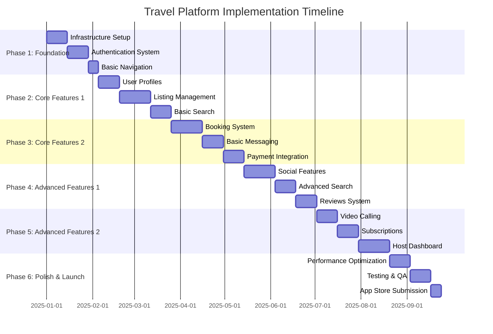

# Implementation Roadmap

## Overview
This roadmap outlines the phased approach to implementing the comprehensive travel platform, prioritizing core functionality while building toward advanced features. Each phase delivers measurable value while establishing the foundation for subsequent phases.

## Development Approach
- **Iterative Development**: Each phase delivers working features
- **Incremental Architecture**: Build upon existing Expo/React Native foundation
- **Continuous Integration**: Deploy and test early and often
- **User Feedback**: Validate features with real users before advancing
- **Parallel Development**: Some tasks can be developed concurrently

## Phase Timeline Overview



## Phase 1: Foundation Infrastructure (Weeks 1-5)

### Objectives
- Establish robust technical foundation
- Implement authentication system
- Create basic app navigation
- Set up development workflows

### Key Deliverables
- ✅ Enhanced project structure
- ✅ Supabase integration
- ✅ Authentication flows (sign in/up/out)
- ✅ Basic navigation with role-based access
- ✅ Theme system enhancement
- ✅ Error handling framework

### Technical Tasks

#### Week 1-2: Infrastructure Setup
```typescript
// Priority: HIGH | Effort: Medium | Dependencies: None

Tasks:
1. Enhance existing folder structure
   - Create src/ directory structure
   - Migrate existing components
   - Set up service layers

2. Supabase Setup
   - Create Supabase project
   - Configure database schema
   - Set up Row Level Security policies
   - Configure Storage buckets

3. Development Environment
   - Environment variable management
   - ESLint and Prettier configuration
   - TypeScript strict mode setup
   - Testing framework setup

4. State Management Setup
   - Install Zustand + middleware
   - Install React Query
   - Create basic stores structure
```

#### Week 3-4: Authentication System
```typescript
// Priority: HIGH | Effort: High | Dependencies: Infrastructure

Tasks:
1. Authentication Service
   - Implement auth service with Supabase
   - Create auth store with Zustand
   - Set up auth state persistence

2. Authentication Screens
   - Sign in screen
   - Sign up screen
   - Forgot password flow
   - Email verification

3. User Profiles
   - Create user_profiles table
   - Profile management service
   - Basic profile components

4. Protected Routes
   - Route protection logic
   - Authentication guards
   - Redirect logic
```

#### Week 5: Basic Navigation
```typescript
// Priority: HIGH | Effort: Low | Dependencies: Authentication

Tasks:
1. Enhanced Tab Navigation
   - Update existing tab layout
   - Add role-based tab visibility
   - Implement navigation permissions

2. Navigation Guards
   - Protected route components
   - Role-based access control
   - Navigation state management

3. Basic Screens Structure
   - Create placeholder screens
   - Implement basic layouts
   - Set up navigation types
```

### Success Criteria
- [ ] Users can sign up, sign in, and sign out
- [ ] Basic role-based navigation works
- [ ] User profiles can be created and viewed
- [ ] App runs on both iOS and Android
- [ ] Development environment is fully configured

---

## Phase 2: Core Features Part 1 (Weeks 6-12)

### Objectives
- Implement user profile management
- Create listing management system
- Build basic search functionality
- Establish content management foundation

### Key Deliverables
- ✅ Complete user profile system
- ✅ Listing creation and management
- ✅ Basic search and filtering
- ✅ Image upload functionality
- ✅ Location services integration

### Technical Tasks

#### Week 6-7: User Profile System
```typescript
// Priority: HIGH | Effort: Medium | Dependencies: Authentication

Tasks:
1. Profile Management
   - Profile edit forms
   - Avatar upload functionality
   - Profile validation
   - Profile completion tracking

2. User Verification System
   - Verification status management
   - Document upload for hosts
   - Verification workflow

3. Role Management
   - Role switching functionality
   - Permission-based UI rendering
   - Onboarding flow for different roles
```

#### Week 8-10: Listing Management System
```typescript
// Priority: HIGH | Effort: High | Dependencies: User Profiles

Tasks:
1. Listing Data Model
   - Implement listing schema
   - Create listing service layer
   - Set up PostGIS for location data

2. Listing Creation
   - Multi-step listing creation form
   - Image upload and management
   - Amenities selection
   - Location picker with maps

3. Listing Management
   - Host listings dashboard
   - Listing edit functionality
   - Listing status management
   - Availability calendar

4. Listing Display
   - Listing card components
   - Listing detail view
   - Image gallery component
   - Map integration
```

#### Week 11-12: Basic Search System
```typescript
// Priority: HIGH | Effort: Medium | Dependencies: Listings

Tasks:
1. Search Infrastructure
   - Search service implementation
   - Search state management
   - Query optimization

2. Search Interface
   - Search bar component
   - Filter interface
   - Search results display
   - Sorting options

3. Location-Based Search
   - Geographic search queries
   - Map-based search
   - Radius filtering
   - Location autocomplete
```

### Success Criteria
- [ ] Users can create and edit complete profiles
- [ ] Hosts can create, edit, and manage listings
- [ ] Users can search listings by location, dates, and basic filters
- [ ] Image upload works reliably
- [ ] Basic map functionality is implemented

---

## Phase 3: Core Features Part 2 (Weeks 13-20)

### Objectives
- Implement complete booking system
- Add basic messaging functionality
- Integrate payment processing
- Create booking management flows

### Key Deliverables
- ✅ End-to-end booking system
- ✅ Stream Chat integration
- ✅ RevenueCat payment processing
- ✅ Booking management for hosts and guests
- ✅ Basic notification system

### Technical Tasks

#### Week 13-15: Booking System
```typescript
// Priority: HIGH | Effort: High | Dependencies: Listings, Search

Tasks:
1. Booking Data Model
   - Booking schema implementation
   - Availability management
   - Pricing calculations
   - Booking state machine

2. Booking Flow
   - Date selection calendar
   - Guest information forms
   - Booking summary
   - Terms and conditions

3. Booking Management
   - Host booking approval/decline
   - Guest booking modification
   - Cancellation policies
   - Booking status tracking

4. Availability System
   - Calendar management
   - Real-time availability updates
   - Blocked dates management
   - Multi-listing availability
```

#### Week 16-17: Basic Messaging
```typescript
// Priority: HIGH | Effort: Medium | Dependencies: Booking System

Tasks:
1. Stream Chat Setup
   - Stream integration
   - User token generation
   - Channel creation logic
   - Message persistence

2. Chat Interface
   - Chat list screen
   - Individual chat screen
   - Message input component
   - Message status indicators

3. Booking-Related Messaging
   - Automatic channel creation for bookings
   - Pre-defined message templates
   - Host-guest communication flow
   - Message notifications
```

#### Week 18-20: Payment Integration
```typescript
// Priority: HIGH | Effort: High | Dependencies: Booking System

Tasks:
1. RevenueCat Setup
   - RevenueCat configuration
   - Product configuration
   - Webhook setup
   - Receipt validation

2. Payment Processing
   - Payment sheet integration
   - Multiple payment methods
   - Payment error handling
   - Refund processing

3. Subscription Infrastructure
   - Basic subscription tiers
   - Feature gating
   - Subscription status tracking
   - Trial period management

4. Financial Management
   - Host payout calculation
   - Platform fee management
   - Tax calculation framework
   - Financial reporting basics
```

### Success Criteria
- [ ] Users can complete end-to-end bookings
- [ ] Hosts can manage booking requests
- [ ] Basic chat functionality works between users
- [ ] Payment processing is secure and reliable
- [ ] Booking confirmations and notifications work

---

## Phase 4: Advanced Features Part 1 (Weeks 21-28)

### Objectives
- Implement social features
- Add advanced search capabilities
- Create review and rating system
- Enhance user engagement

### Key Deliverables
- ✅ Social feed and user interactions
- ✅ Advanced search with filters
- ✅ Comprehensive review system
- ✅ User favorites and wishlists
- ✅ Enhanced notifications

### Technical Tasks

#### Week 21-23: Social Features
```typescript
// Priority: MEDIUM | Effort: High | Dependencies: User Profiles, Messaging

Tasks:
1. Stream Activity Feeds
   - Activity feed setup
   - Post creation and management
   - Like and comment systems
   - User following system

2. Social Components
   - Social feed interface
   - Post composer
   - User interaction components
   - Activity notifications

3. User Connections
   - Friend/following system
   - User discovery
   - Social profile enhancements
   - Privacy settings

4. Content Moderation
   - Basic content filtering
   - Report functionality
   - Admin moderation tools
   - Community guidelines
```

#### Week 24-25: Advanced Search
```typescript
// Priority: MEDIUM | Effort: Medium | Dependencies: Basic Search

Tasks:
1. Enhanced Search Filters
   - Price range filters
   - Amenities filtering
   - Property type filters
   - Host rating filters

2. Search Optimization
   - Search result ranking
   - Personalized recommendations
   - Search history
   - Saved searches

3. Map-Based Search
   - Interactive map search
   - Cluster markers
   - Map bounds filtering
   - Street view integration

4. Search Analytics
   - Search tracking
   - Popular searches
   - Search result optimization
   - A/B testing framework
```

#### Week 26-28: Reviews and Ratings
```typescript
// Priority: HIGH | Effort: Medium | Dependencies: Booking System

Tasks:
1. Review System
   - Review data model
   - Review submission flow
   - Review moderation
   - Review display components

2. Rating System
   - Multi-category ratings
   - Average rating calculations
   - Rating distribution
   - Review analytics

3. Review Management
   - Host response system
   - Review editing/deletion
   - Review dispute process
   - Review quality scoring

4. Trust and Safety
   - Fake review detection
   - User verification impact
   - Trust score calculation
   - Safety reporting
```

### Success Criteria
- [ ] Users can post and interact with social content
- [ ] Advanced search filters work effectively
- [ ] Review system builds trust between users
- [ ] Search recommendations improve user experience
- [ ] User engagement metrics show positive trends

---

## Phase 5: Advanced Features Part 2 (Weeks 29-36)

### Objectives
- Implement video calling capabilities
- Launch subscription tiers
- Create comprehensive host dashboard
- Add advanced monetization features

### Key Deliverables
- ✅ Stream Video integration
- ✅ Subscription paywall system
- ✅ Advanced host analytics
- ✅ Business intelligence dashboard
- ✅ Premium features

### Technical Tasks

#### Week 29-30: Video Calling
```typescript
// Priority: MEDIUM | Effort: Medium | Dependencies: Messaging

Tasks:
1. Stream Video Setup
   - Video SDK integration
   - Call management
   - Device permissions
   - Call quality optimization

2. Video Call Interface
   - Call invitation system
   - Video call controls
   - Screen sharing (optional)
   - Call recording (premium)

3. Call Management
   - Call history
   - Call scheduling
   - Call notifications
   - Call quality metrics

4. Integration with Chat
   - Video call buttons in chat
   - Call summaries
   - File sharing during calls
   - Call-to-action flows
```

#### Week 31-32: Subscription System
```typescript
// Priority: HIGH | Effort: Medium | Dependencies: Payment Integration

Tasks:
1. Subscription Tiers
   - Tier definition and configuration
   - Feature gate implementation
   - Upgrade/downgrade flows
   - Grandfathering logic

2. Paywall System
   - Feature access gates
   - Subscription prompts
   - Trial period management
   - Subscription onboarding

3. Premium Features
   - Advanced search filters
   - Unlimited messaging
   - Priority customer support
   - Advanced analytics

4. Subscription Management
   - Billing management
   - Subscription analytics
   - Churn prevention
   - Customer lifecycle management
```

#### Week 33-36: Host Dashboard
```typescript
// Priority: HIGH | Effort: High | Dependencies: Booking System, Reviews

Tasks:
1. Analytics Dashboard
   - Booking analytics
   - Revenue tracking
   - Performance metrics
   - Competitive analysis

2. Listing Management
   - Multi-listing management
   - Bulk operations
   - Listing optimization suggestions
   - Performance insights

3. Guest Management
   - Guest communication tools
   - Guest history tracking
   - Guest screening tools
   - Automated responses

4. Financial Management
   - Payout management
   - Tax document generation
   - Expense tracking
   - Pricing optimization

5. Business Intelligence
   - Market insights
   - Seasonal trends
   - Demand forecasting
   - Pricing recommendations
```

### Success Criteria
- [ ] Video calling works reliably across platforms
- [ ] Subscription system drives revenue growth
- [ ] Hosts have comprehensive business management tools
- [ ] Premium features provide clear value
- [ ] Host retention and satisfaction improve

---

## Phase 6: Polish & Launch (Weeks 37-42)

### Objectives
- Optimize app performance
- Complete comprehensive testing
- Prepare for app store launch
- Establish monitoring and analytics

### Key Deliverables
- ✅ Production-ready application
- ✅ Comprehensive test coverage
- ✅ App store compliance
- ✅ Monitoring and analytics
- ✅ Launch marketing materials

### Technical Tasks

#### Week 37-38: Performance Optimization
```typescript
// Priority: HIGH | Effort: Medium | Dependencies: All Previous Phases

Tasks:
1. Performance Auditing
   - Bundle size optimization
   - Image optimization
   - Lazy loading implementation
   - Memory leak detection

2. Caching Optimization
   - Query optimization
   - Cache strategy refinement
   - Offline functionality
   - Background sync

3. User Experience Polish
   - Animation optimization
   - Loading state improvements
   - Error state refinement
   - Accessibility enhancements

4. Platform Optimization
   - iOS-specific optimizations
   - Android-specific optimizations
   - Web platform support
   - Cross-platform consistency
```

#### Week 39-40: Testing & QA
```typescript
// Priority: HIGH | Effort: High | Dependencies: Performance Optimization

Tasks:
1. Automated Testing
   - Unit test coverage >80%
   - Integration test suite
   - E2E testing setup
   - Performance testing

2. Manual Testing
   - User journey testing
   - Device compatibility testing
   - Edge case testing
   - Accessibility testing

3. Beta Testing
   - Internal beta program
   - External beta testing
   - Feedback collection
   - Bug fixing and refinement

4. Security Testing
   - Security audit
   - Penetration testing
   - Data privacy compliance
   - Third-party security review
```

#### Week 41-42: Launch Preparation
```typescript
// Priority: HIGH | Effort: Medium | Dependencies: Testing & QA

Tasks:
1. App Store Preparation
   - App store metadata
   - Screenshots and videos
   - App store guidelines compliance
   - Review preparation

2. Production Infrastructure
   - Production environment setup
   - Monitoring and logging
   - Backup and recovery
   - Scalability preparation

3. Launch Strategy
   - Marketing material preparation
   - Press kit creation
   - Launch timeline
   - Post-launch monitoring

4. Documentation
   - User documentation
   - API documentation
   - Deployment guides
   - Troubleshooting guides
```

### Success Criteria
- [ ] App passes all store review processes
- [ ] Performance metrics meet targets
- [ ] Test coverage exceeds 80%
- [ ] Production monitoring is operational
- [ ] Launch materials are ready

---

## Risk Management & Contingency Plans

### Technical Risks
1. **Third-party Service Downtime**
   - Risk: Supabase, Stream, or RevenueCat outages
   - Mitigation: Implement offline functionality, service health monitoring
   - Contingency: Alternative service providers identified

2. **Performance Issues**
   - Risk: App becomes slow with scale
   - Mitigation: Regular performance testing, optimization sprints
   - Contingency: Performance optimization phase extension

3. **Integration Complexity**
   - Risk: Complex integrations take longer than expected
   - Mitigation: Early prototyping, technical spikes
   - Contingency: Feature scope reduction, alternative approaches

### Business Risks
1. **Feature Scope Creep**
   - Risk: Requirements expand beyond plan
   - Mitigation: Clear phase boundaries, change control process
   - Contingency: Feature prioritization, future phase deferral

2. **Market Changes**
   - Risk: Travel industry changes affect requirements
   - Mitigation: Market monitoring, flexible architecture
   - Contingency: Pivot capability, feature adaptability

3. **User Adoption**
   - Risk: Low user adoption affects viability
   - Mitigation: User research, beta testing, feedback loops
   - Contingency: Marketing strategy adjustment, feature refinement

## Success Metrics by Phase

### Phase 1-2 (Foundation & Core 1)
- Technical debt remains manageable
- Development velocity is sustainable
- Core user flows are complete

### Phase 3-4 (Core 2 & Advanced 1)
- User engagement > 60% DAU/MAU
- Booking conversion rate > 15%
- Host onboarding completion > 70%

### Phase 5-6 (Advanced 2 & Launch)
- App store ratings > 4.2/5
- Revenue growth > 20% MoM
- Host retention > 80% at 6 months

## Resource Requirements

### Development Team (Estimated)
- **1 Senior React Native Developer** (Full project)
- **1 Backend/Full-stack Developer** (Phases 1-4)
- **1 UI/UX Designer** (Phases 2-5, part-time)
- **1 QA Engineer** (Phases 4-6)
- **1 DevOps Engineer** (Phases 1, 6, part-time)

### External Services Budget (Monthly)
- Supabase: $25-100 (based on usage)
- Stream: $99-499 (based on features)
- RevenueCat: $0-99 (based on revenue)
- Additional services: $50-200

This roadmap provides a structured approach to building a comprehensive travel platform while maintaining flexibility to adapt to changing requirements and market conditions.