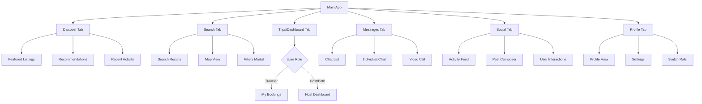
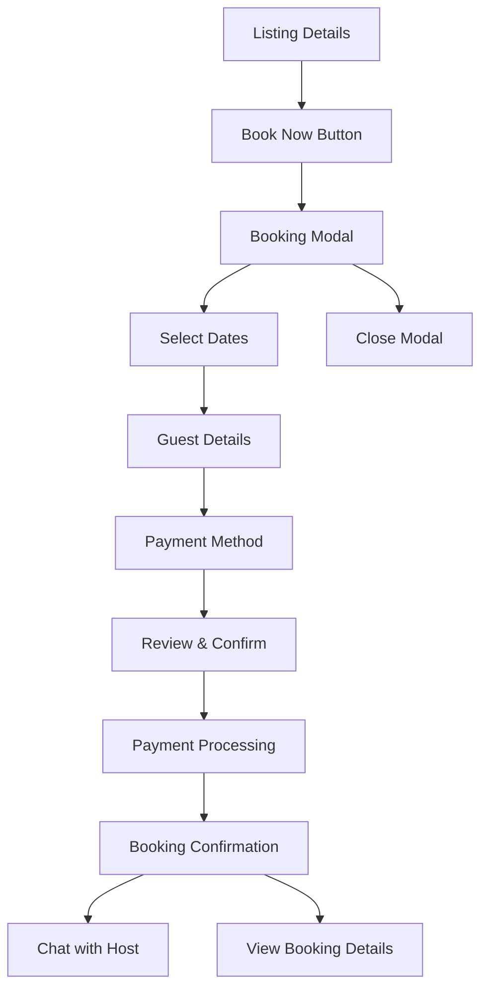

# Navigation Structure

## Overview
The travel platform uses Expo Router's file-based routing system, building upon the existing tab navigation to create a comprehensive navigation experience that adapts to user roles and authentication states.

## Current Foundation (Enhanced)
- ✅ [`app/_layout.tsx`](app/_layout.tsx) - Root Stack navigation
- ✅ [`app/(tabs)/_layout.tsx`](app/(tabs)/_layout.tsx) - Tab navigation
- ✅ [`app/modal.tsx`](app/modal.tsx) - Modal presentation
- ✅ Expo Router with typed routes enabled

## Navigation Architecture

### 1. Root Navigation Structure
```
app/
├── _layout.tsx                   # Root Stack Navigator
├── +not-found.tsx               # 404 Error page
├── (auth)/                      # Authentication group (unauthenticated only)
├── (onboarding)/                # Onboarding flow (first-time users)
├── (tabs)/                      # Main app tabs (authenticated users)
├── (host)/                      # Host-specific screens
├── (modals)/                    # Modal overlays
├── listing/                     # Listing details & actions
├── booking/                     # Booking flow & management
├── chat/                        # Chat & video call screens
├── profile/                     # Profile & user screens
└── subscription/                # RevenueCat subscription screens
```

### 2. Enhanced Root Layout
```typescript
// app/_layout.tsx (Enhanced)
import { DarkTheme, DefaultTheme, ThemeProvider } from '@react-navigation/native';
import { Stack } from 'expo-router';
import { StatusBar } from 'expo-status-bar';
import { useEffect } from 'react';
import 'react-native-reanimated';

import { useAuthStore } from '@/src/stores/auth-store';
import { initializeServices } from '@/src/services';
import { LoadingScreen } from '@/src/components/ui/loading-screen';
import { useColorScheme } from '@/hooks/use-color-scheme';

export const unstable_settings = {
  initialRouteName: '(tabs)',
};

export default function RootLayout() {
  const colorScheme = useColorScheme();
  const { user, isLoading, initialize } = useAuthStore();

  useEffect(() => {
    initialize();
  }, []);

  useEffect(() => {
    if (user) {
      initializeServices(user);
    }
  }, [user]);

  if (isLoading) {
    return <LoadingScreen />;
  }

  return (
    <ThemeProvider value={colorScheme === 'dark' ? DarkTheme : DefaultTheme}>
      <Stack screenOptions={{ headerShown: false }}>
        {/* Authentication required check */}
        {!user ? (
          <>
            <Stack.Screen name="(auth)" />
            <Stack.Screen name="(onboarding)" />
          </>
        ) : (
          <>
            <Stack.Screen name="(tabs)" />
            <Stack.Screen name="(host)" />
            
            {/* Modal screens */}
            <Stack.Screen name="(modals)/booking-flow" options={{ presentation: 'modal' }} />
            <Stack.Screen name="(modals)/filters" options={{ presentation: 'modal' }} />
            <Stack.Screen name="(modals)/post-composer" options={{ presentation: 'modal' }} />
            <Stack.Screen name="(modals)/image-gallery" options={{ presentation: 'fullScreenModal' }} />
            
            {/* Regular screens */}
            <Stack.Screen name="listing/[id]" />
            <Stack.Screen name="booking/[id]/details" />
            <Stack.Screen name="chat/[channelId]" />
            <Stack.Screen name="chat/video-call/[callId]" options={{ presentation: 'fullScreenModal' }} />
            <Stack.Screen name="profile/[userId]" />
            <Stack.Screen name="subscription/plans" options={{ presentation: 'modal' }} />
          </>
        )}
        
        <Stack.Screen name="+not-found" />
      </Stack>
      <StatusBar style="auto" />
    </ThemeProvider>
  );
}
```

### 3. Authentication Navigation Group
```typescript
// app/(auth)/_layout.tsx
import { Stack } from 'expo-router';
import { Redirect } from 'expo-router';
import { useAuthStore } from '@/src/stores/auth-store';

export default function AuthLayout() {
  const { user } = useAuthStore();

  // Redirect to main app if already authenticated
  if (user) {
    return <Redirect href="/(tabs)" />;
  }

  return (
    <Stack screenOptions={{ headerShown: false }}>
      <Stack.Screen name="sign-in" />
      <Stack.Screen name="sign-up" />
      <Stack.Screen name="forgot-password" />
      <Stack.Screen name="verify-email" />
      <Stack.Screen name="phone-verification" />
    </Stack>
  );
}

// Screen files:
// app/(auth)/sign-in.tsx
// app/(auth)/sign-up.tsx
// app/(auth)/forgot-password.tsx
// app/(auth)/verify-email.tsx
// app/(auth)/phone-verification.tsx
```

### 4. Onboarding Navigation Group
```typescript
// app/(onboarding)/_layout.tsx
import { Stack } from 'expo-router';
import { Redirect } from 'expo-router';
import { useAuthStore } from '@/src/stores/auth-store';

export default function OnboardingLayout() {
  const { user, profile } = useAuthStore();

  // Redirect to auth if not authenticated
  if (!user) {
    return <Redirect href="/(auth)/sign-in" />;
  }

  // Redirect to main app if onboarding is complete
  if (profile?.onboarding_completed) {
    return <Redirect href="/(tabs)" />;
  }

  return (
    <Stack screenOptions={{ headerShown: false }}>
      <Stack.Screen name="welcome" />
      <Stack.Screen name="user-type-selection" />
      <Stack.Screen name="traveler-setup" />
      <Stack.Screen name="host-setup" />
      <Stack.Screen name="verification" />
      <Stack.Screen name="complete" />
    </Stack>
  );
}

// Screen files:
// app/(onboarding)/welcome.tsx
// app/(onboarding)/user-type-selection.tsx
// app/(onboarding)/traveler-setup.tsx
// app/(onboarding)/host-setup.tsx
// app/(onboarding)/verification.tsx
// app/(onboarding)/complete.tsx
```

### 5. Enhanced Tab Navigation
```typescript
// app/(tabs)/_layout.tsx (Enhanced)
import { Tabs, useRouter } from 'expo-router';
import React from 'react';

import { HapticTab } from '@/components/haptic-tab';
import { IconSymbol } from '@/components/ui/icon-symbol';
import { Colors } from '@/constants/theme';
import { useColorScheme } from '@/hooks/use-color-scheme';
import { useAuthStore } from '@/src/stores/auth-store';
import { useMessageStore } from '@/src/stores/message-store';

export default function TabLayout() {
  const colorScheme = useColorScheme();
  const { profile } = useAuthStore();
  const { unreadCount } = useMessageStore();
  const router = useRouter();

  // Redirect to onboarding if profile incomplete
  if (profile && !profile.onboarding_completed) {
    router.replace('/(onboarding)/welcome');
    return null;
  }

  const isHost = profile?.role === 'host' || profile?.role === 'both';

  return (
    <Tabs
      screenOptions={{
        tabBarActiveTintColor: Colors[colorScheme ?? 'light'].tint,
        headerShown: false,
        tabBarButton: HapticTab,
      }}>
      
      {/* Home/Discovery Tab */}
      <Tabs.Screen
        name="index"
        options={{
          title: 'Discover',
          tabBarIcon: ({ color }) => <IconSymbol size={28} name="house.fill" color={color} />,
        }}
      />
      
      {/* Search/Explore Tab */}
      <Tabs.Screen
        name="explore"
        options={{
          title: 'Search',
          tabBarIcon: ({ color }) => <IconSymbol size={28} name="magnifyingglass" color={color} />,
        }}
      />
      
      {/* Bookings Tab (Travelers) or Host Dashboard (Hosts) */}
      <Tabs.Screen
        name={isHost ? "host-dashboard" : "bookings"}
        options={{
          title: isHost ? 'Dashboard' : 'Trips',
          tabBarIcon: ({ color }) => (
            <IconSymbol 
              size={28} 
              name={isHost ? "chart.bar.fill" : "calendar"} 
              color={color} 
            />
          ),
        }}
      />
      
      {/* Messages Tab */}
      <Tabs.Screen
        name="messages"
        options={{
          title: 'Messages',
          tabBarIcon: ({ color }) => <IconSymbol size={28} name="message.fill" color={color} />,
          tabBarBadge: unreadCount > 0 ? unreadCount.toString() : undefined,
        }}
      />
      
      {/* Social Feed Tab */}
      <Tabs.Screen
        name="social"
        options={{
          title: 'Social',
          tabBarIcon: ({ color }) => <IconSymbol size={28} name="heart.fill" color={color} />,
        }}
      />
      
      {/* Profile Tab */}
      <Tabs.Screen
        name="profile"
        options={{
          title: 'Profile',
          tabBarIcon: ({ color }) => <IconSymbol size={28} name="person.fill" color={color} />,
        }}
      />
    </Tabs>
  );
}

// Screen files:
// app/(tabs)/index.tsx - Home/Discovery
// app/(tabs)/explore.tsx - Search & Filters (enhanced)
// app/(tabs)/bookings.tsx - User bookings management
// app/(tabs)/host-dashboard.tsx - Host dashboard
// app/(tabs)/messages.tsx - Chat interface
// app/(tabs)/social.tsx - Social feed
// app/(tabs)/profile.tsx - User profile
```

### 6. Host Navigation Group
```typescript
// app/(host)/_layout.tsx
import { Stack } from 'expo-router';
import { Redirect } from 'expo-router';
import { useAuthStore } from '@/src/stores/auth-store';

export default function HostLayout() {
  const { user, profile } = useAuthStore();

  // Redirect if not authenticated or not a host
  if (!user || (profile?.role !== 'host' && profile?.role !== 'both')) {
    return <Redirect href="/(tabs)" />;
  }

  return (
    <Stack>
      <Stack.Screen 
        name="listings/index" 
        options={{ title: 'My Listings' }}
      />
      <Stack.Screen 
        name="listings/create" 
        options={{ title: 'Create Listing', presentation: 'modal' }}
      />
      <Stack.Screen 
        name="listings/[id]/edit" 
        options={{ title: 'Edit Listing' }}
      />
      <Stack.Screen 
        name="listings/[id]/analytics" 
        options={{ title: 'Listing Analytics' }}
      />
      <Stack.Screen 
        name="bookings/manage" 
        options={{ title: 'Manage Bookings' }}
      />
      <Stack.Screen 
        name="earnings" 
        options={{ title: 'Earnings' }}
      />
      <Stack.Screen 
        name="calendar-management" 
        options={{ title: 'Calendar Management' }}
      />
    </Stack>
  );
}

// Screen files:
// app/(host)/listings/index.tsx - Host listings overview
// app/(host)/listings/create.tsx - Create new listing
// app/(host)/listings/[id]/edit.tsx - Edit listing
// app/(host)/listings/[id]/analytics.tsx - Listing analytics
// app/(host)/bookings/manage.tsx - Manage booking requests
// app/(host)/earnings.tsx - Earnings dashboard
// app/(host)/calendar-management.tsx - Availability management
```

### 7. Modal Navigation Group
```typescript
// app/(modals)/_layout.tsx
import { Stack } from 'expo-router';

export default function ModalLayout() {
  return (
    <Stack>
      <Stack.Screen 
        name="booking-flow" 
        options={{ title: 'Book Now', presentation: 'modal' }}
      />
      <Stack.Screen 
        name="filters" 
        options={{ title: 'Filters', presentation: 'modal' }}
      />
      <Stack.Screen 
        name="post-composer" 
        options={{ title: 'New Post', presentation: 'modal' }}
      />
      <Stack.Screen 
        name="image-gallery" 
        options={{ headerShown: false, presentation: 'fullScreenModal' }}
      />
      <Stack.Screen 
        name="video-call" 
        options={{ headerShown: false, presentation: 'fullScreenModal' }}
      />
      <Stack.Screen 
        name="payment-sheet" 
        options={{ title: 'Payment', presentation: 'modal' }}
      />
    </Stack>
  );
}

// Screen files:
// app/(modals)/booking-flow.tsx - Multi-step booking process
// app/(modals)/filters.tsx - Search filters modal
// app/(modals)/post-composer.tsx - Create social post
// app/(modals)/image-gallery.tsx - Full-screen image gallery
// app/(modals)/video-call.tsx - Video call interface
// app/(modals)/payment-sheet.tsx - Payment processing
```

## Navigation Flow Diagrams

### 1. Authentication Flow
```mermaid
graph TD
    A[App Launch] --> B{User Authenticated?}
    B -->|No| C[(auth) Group]
    B -->|Yes| D{Onboarding Complete?}
    
    C --> E[Sign In]
    C --> F[Sign Up]
    C --> G[Forgot Password]
    
    E --> H[Authentication Success]
    F --> H
    
    H --> D
    D -->|No| I[(onboarding) Group]
    D -->|Yes| J[(tabs) Main App]
    
    I --> K[Welcome]
    I --> L[User Type Selection]
    I --> M[Profile Setup]
    I --> N[Verification]
    I --> O[Complete]
    
    O --> J
```

### 2. Main App Navigation


### 3. Booking Flow


## Role-Based Navigation

### Navigation Permissions
```typescript
// src/utils/navigation-permissions.ts
interface NavigationPermissions {
  canAccessHostDashboard: boolean;
  canCreateListings: boolean;
  canAccessAnalytics: boolean;
  canManageBookings: boolean;
  canAccessPremiumFeatures: boolean;
}

export const getNavigationPermissions = (
  userRole: UserRole, 
  subscription: Subscription | null
): NavigationPermissions => {
  const isHost = userRole === 'host' || userRole === 'both';
  const hasPremium = subscription?.status === 'active';
  
  return {
    canAccessHostDashboard: isHost,
    canCreateListings: isHost,
    canAccessAnalytics: isHost,
    canManageBookings: isHost,
    canAccessPremiumFeatures: hasPremium,
  };
};
```

### Conditional Navigation Rendering
```typescript
// Custom hook for navigation permissions
export const useNavigationPermissions = () => {
  const { profile } = useAuthStore();
  const { subscription } = useSubscriptionStore();
  
  return useMemo(() => {
    if (!profile) return null;
    return getNavigationPermissions(profile.role, subscription);
  }, [profile, subscription]);
};

// Usage in navigation components
const TabLayout = () => {
  const permissions = useNavigationPermissions();
  
  return (
    <Tabs>
      {permissions?.canAccessHostDashboard && (
        <Tabs.Screen name="host-dashboard" {...hostTabOptions} />
      )}
      {/* Other conditional tabs */}
    </Tabs>
  );
};
```

## Deep Linking & URL Structure

### URL Patterns
```typescript
// Expo Router URL structure
const urlPatterns = {
  // Authentication
  '/auth/sign-in': 'Sign in page',
  '/auth/sign-up': 'Sign up page',
  
  // Main app
  '/': 'Home/Discovery',
  '/explore': 'Search page',
  '/bookings': 'User bookings',
  '/messages': 'Chat list',
  '/social': 'Social feed',
  '/profile': 'User profile',
  
  // Listings
  '/listing/[id]': 'Listing details',
  '/listing/[id]/book': 'Booking modal',
  
  // Bookings
  '/booking/[id]/details': 'Booking details',
  '/booking/[id]/receipt': 'Booking receipt',
  
  // Chat
  '/chat/[channelId]': 'Chat conversation',
  '/chat/video-call/[callId]': 'Video call',
  
  // Profile
  '/profile/[userId]': 'User profile',
  '/profile/edit': 'Edit profile',
  
  // Host
  '/host/dashboard': 'Host dashboard',
  '/host/listings': 'Host listings',
  '/host/listings/create': 'Create listing',
  '/host/listings/[id]/edit': 'Edit listing',
  
  // Subscription
  '/subscription/plans': 'Subscription plans',
  '/subscription/manage': 'Manage subscription',
};
```

### Link Handling
```typescript
// src/utils/linking.ts
import * as Linking from 'expo-linking';

const prefix = Linking.createURL('/');

export const linking = {
  prefixes: [prefix, 'https://myapp.com'],
  config: {
    screens: {
      '(auth)': {
        screens: {
          'sign-in': 'auth/sign-in',
          'sign-up': 'auth/sign-up',
        },
      },
      '(tabs)': {
        screens: {
          index: '',
          explore: 'explore',
          bookings: 'bookings',
          messages: 'messages',
          social: 'social',
          profile: 'profile',
        },
      },
      'listing/[id]': 'listing/:id',
      'chat/[channelId]': 'chat/:channelId',
      'profile/[userId]': 'profile/:userId',
    },
  },
};
```

This navigation structure provides:
- **Role-Based Access**: Different navigation based on user type
- **Authentication Flow**: Seamless onboarding and auth flows
- **Modal Management**: Proper modal presentation for booking and payments
- **Deep Linking**: Full URL support for sharing and bookmarking
- **Type Safety**: Full TypeScript support with Expo Router
- **Scalable Architecture**: Easy to extend with new features
- **Responsive Design**: Adapts to different user states and permissions