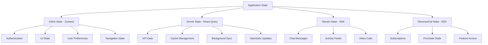

# State Management Strategy

## Overview
The travel platform uses a hybrid state management approach combining Zustand for client state, React Query for server state, and native integrations with Stream and RevenueCat for their respective domains.

## State Management Architecture

### State Categories


## 1. Client State Management (Zustand)

### Store Architecture
```typescript
// src/stores/index.ts
export { useAuthStore } from './auth-store';
export { useUserStore } from './user-store';
export { useUIStore } from './ui-store';
export { useLocationStore } from './location-store';
export { useSearchStore } from './search-store';
export { useBookingStore } from './booking-store';
export { useMessageStore } from './message-store';
export { useSubscriptionStore } from './subscription-store';

// Store initialization
export const initializeStores = async () => {
  // Initialize all stores with persisted data
  await Promise.all([
    useAuthStore.getState().initialize(),
    useUserStore.getState().initialize(),
    useUIStore.getState().initialize(),
  ]);
};
```

### Authentication Store
```typescript
// src/stores/auth-store.ts
import { create } from 'zustand';
import { persist } from 'zustand/middleware';
import { immer } from 'zustand/middleware/immer';
import { subscribeWithSelector } from 'zustand/middleware';

import { supabase } from '@/src/services/supabase/client';
import type { User, UserProfile } from '@/src/types';

interface AuthState {
  // State
  user: User | null;
  profile: UserProfile | null;
  session: Session | null;
  isLoading: boolean;
  error: string | null;
  
  // Computed
  isAuthenticated: boolean;
  requiresOnboarding: boolean;
  permissions: UserPermissions;
  
  // Actions
  initialize: () => Promise<void>;
  signIn: (credentials: SignInCredentials) => Promise<void>;
  signUp: (credentials: SignUpCredentials) => Promise<void>;
  signOut: () => Promise<void>;
  updateProfile: (updates: Partial<UserProfile>) => Promise<void>;
  switchRole: (newRole: UserRole) => Promise<void>;
  setLoading: (loading: boolean) => void;
  setError: (error: string | null) => void;
  clearError: () => void;
}

export const useAuthStore = create<AuthState>()(
  subscribeWithSelector(
    persist(
      immer((set, get) => ({
        // Initial state
        user: null,
        profile: null,
        session: null,
        isLoading: true,
        error: null,
        
        // Computed getters
        get isAuthenticated() {
          return !!get().user;
        },
        
        get requiresOnboarding() {
          const { profile } = get();
          return profile && !profile.onboarding_completed;
        },
        
        get permissions() {
          const { profile } = get();
          return profile ? getPermissionsForRole(profile.role) : {};
        },
        
        // Actions
        initialize: async () => {
          set(state => {
            state.isLoading = true;
          });
          
          try {
            const { data: { session } } = await supabase.auth.getSession();
            
            if (session?.user) {
              const { data: profile } = await supabase
                .from('user_profiles')
                .select('*')
                .eq('id', session.user.id)
                .single();
              
              set(state => {
                state.user = session.user;
                state.session = session;
                state.profile = profile;
                state.isLoading = false;
              });
            } else {
              set(state => {
                state.isLoading = false;
              });
            }
          } catch (error) {
            set(state => {
              state.error = error.message;
              state.isLoading = false;
            });
          }
        },
        
        signIn: async (credentials) => {
          set(state => {
            state.isLoading = true;
            state.error = null;
          });
          
          try {
            const { data, error } = await supabase.auth.signInWithPassword(credentials);
            
            if (error) throw error;
            
            if (data.user) {
              const { data: profile } = await supabase
                .from('user_profiles')
                .select('*')
                .eq('id', data.user.id)
                .single();
              
              set(state => {
                state.user = data.user;
                state.session = data.session;
                state.profile = profile;
                state.isLoading = false;
              });
            }
          } catch (error) {
            set(state => {
              state.error = error.message;
              state.isLoading = false;
            });
            throw error;
          }
        },
        
        signOut: async () => {
          await supabase.auth.signOut();
          
          set(state => {
            state.user = null;
            state.profile = null;
            state.session = null;
            state.error = null;
          });
        },
        
        updateProfile: async (updates) => {
          const { user } = get();
          if (!user) throw new Error('Not authenticated');
          
          const { data, error } = await supabase
            .from('user_profiles')
            .update(updates)
            .eq('id', user.id)
            .select()
            .single();
          
          if (error) throw error;
          
          set(state => {
            state.profile = data;
          });
        },
        
        // Utility actions
        setLoading: (loading) => set(state => {
          state.isLoading = loading;
        }),
        
        setError: (error) => set(state => {
          state.error = error;
        }),
        
        clearError: () => set(state => {
          state.error = null;
        }),
      })),
      {
        name: 'auth-store',
        partialize: (state) => ({
          user: state.user,
          profile: state.profile,
          session: state.session,
        }),
      }
    )
  )
);

// Auth state subscription for side effects
useAuthStore.subscribe(
  (state) => state.user,
  (user, prevUser) => {
    if (user && !prevUser) {
      // User logged in - initialize services
      initializeUserServices(user);
    } else if (!user && prevUser) {
      // User logged out - cleanup services
      cleanupUserServices();
    }
  }
);
```

### UI State Store
```typescript
// src/stores/ui-store.ts
interface UIState {
  // Theme
  theme: 'light' | 'dark' | 'system';
  
  // Navigation
  currentTab: string;
  navigationHistory: string[];
  
  // Modals
  activeModal: string | null;
  modalData: any;
  
  // Loading states
  globalLoading: boolean;
  loadingStates: Record<string, boolean>;
  
  // Search
  searchQuery: string;
  searchFilters: SearchFilters;
  recentSearches: string[];
  
  // Actions
  setTheme: (theme: 'light' | 'dark' | 'system') => void;
  setCurrentTab: (tab: string) => void;
  pushToHistory: (route: string) => void;
  showModal: (modal: string, data?: any) => void;
  hideModal: () => void;
  setGlobalLoading: (loading: boolean) => void;
  setLoadingState: (key: string, loading: boolean) => void;
  updateSearchQuery: (query: string) => void;
  updateSearchFilters: (filters: Partial<SearchFilters>) => void;
  addRecentSearch: (query: string) => void;
}

export const useUIStore = create<UIState>()(
  persist(
    immer((set, get) => ({
      // Initial state
      theme: 'system',
      currentTab: 'index',
      navigationHistory: [],
      activeModal: null,
      modalData: null,
      globalLoading: false,
      loadingStates: {},
      searchQuery: '',
      searchFilters: {},
      recentSearches: [],
      
      // Actions
      setTheme: (theme) => set(state => {
        state.theme = theme;
      }),
      
      setCurrentTab: (tab) => set(state => {
        state.currentTab = tab;
      }),
      
      pushToHistory: (route) => set(state => {
        state.navigationHistory.push(route);
        // Keep only last 20 routes
        if (state.navigationHistory.length > 20) {
          state.navigationHistory = state.navigationHistory.slice(-20);
        }
      }),
      
      showModal: (modal, data) => set(state => {
        state.activeModal = modal;
        state.modalData = data;
      }),
      
      hideModal: () => set(state => {
        state.activeModal = null;
        state.modalData = null;
      }),
      
      updateSearchQuery: (query) => set(state => {
        state.searchQuery = query;
      }),
      
      addRecentSearch: (query) => set(state => {
        const filtered = state.recentSearches.filter(s => s !== query);
        state.recentSearches = [query, ...filtered].slice(0, 10);
      }),
    })),
    {
      name: 'ui-store',
      partialize: (state) => ({
        theme: state.theme,
        searchFilters: state.searchFilters,
        recentSearches: state.recentSearches,
      }),
    }
  )
);
```

### Location Store
```typescript
// src/stores/location-store.ts
interface LocationState {
  currentLocation: Location | null;
  permissionStatus: 'undetermined' | 'granted' | 'denied';
  locationHistory: Location[];
  isTracking: boolean;
  
  // Actions
  requestPermission: () => Promise<boolean>;
  getCurrentLocation: () => Promise<Location>;
  startTracking: () => void;
  stopTracking: () => void;
  addLocationToHistory: (location: Location) => void;
}

export const useLocationStore = create<LocationState>()(
  immer((set, get) => ({
    currentLocation: null,
    permissionStatus: 'undetermined',
    locationHistory: [],
    isTracking: false,
    
    requestPermission: async () => {
      const { status } = await Location.requestForegroundPermissionsAsync();
      
      set(state => {
        state.permissionStatus = status === 'granted' ? 'granted' : 'denied';
      });
      
      return status === 'granted';
    },
    
    getCurrentLocation: async () => {
      const { permissionStatus } = get();
      
      if (permissionStatus !== 'granted') {
        throw new Error('Location permission denied');
      }
      
      const location = await Location.getCurrentPositionAsync({
        accuracy: Location.Accuracy.High,
      });
      
      set(state => {
        state.currentLocation = location;
      });
      
      return location;
    },
    
    // ... other actions
  }))
);
```

## 2. Server State Management (React Query)

### Query Client Configuration
```typescript
// src/lib/react-query.ts
import { QueryClient, QueryClientProvider } from '@tanstack/react-query';
import { persistQueryClient } from '@tanstack/react-query-persist-client-core';
import { createAsyncStoragePersister } from '@tanstack/query-async-storage-persister';
import AsyncStorage from '@react-native-async-storage/async-storage';

const queryClient = new QueryClient({
  defaultOptions: {
    queries: {
      staleTime: 1000 * 60 * 5, // 5 minutes
      cacheTime: 1000 * 60 * 30, // 30 minutes
      retry: 3,
      refetchOnWindowFocus: false,
      refetchOnReconnect: true,
    },
    mutations: {
      retry: 1,
    },
  },
});

// Persistence setup
const asyncStoragePersister = createAsyncStoragePersister({
  storage: AsyncStorage,
  key: 'REACT_QUERY_CACHE',
});

export const setupQueryClientPersistence = () => {
  persistQueryClient({
    queryClient,
    persister: asyncStoragePersister,
    maxAge: 1000 * 60 * 60 * 24, // 24 hours
  });
};

export { queryClient };
```

### Query Hooks
```typescript
// src/hooks/queries/use-listings.ts
import { useQuery, useMutation, useQueryClient } from '@tanstack/react-query';
import { supabase } from '@/src/services/supabase/client';

export const useListings = (filters: ListingFilters = {}) => {
  return useQuery({
    queryKey: ['listings', filters],
    queryFn: async () => {
      let query = supabase
        .from('listings')
        .select(`
          *,
          host:user_profiles!listings_host_id_fkey(*)
        `)
        .eq('status', 'active');

      // Apply filters
      if (filters.location) {
        query = query.within('coordinates', filters.location);
      }
      
      if (filters.priceRange) {
        query = query.gte('base_price', filters.priceRange.min)
                    .lte('base_price', filters.priceRange.max);
      }
      
      const { data, error } = await query;
      
      if (error) throw error;
      return data;
    },
    enabled: true,
  });
};

export const useListingById = (id: string) => {
  return useQuery({
    queryKey: ['listing', id],
    queryFn: async () => {
      const { data, error } = await supabase
        .from('listings')
        .select(`
          *,
          host:user_profiles!listings_host_id_fkey(*),
          amenities:listing_amenities(amenity:amenities(*))
        `)
        .eq('id', id)
        .single();
      
      if (error) throw error;
      return data;
    },
    enabled: !!id,
  });
};

export const useCreateListing = () => {
  const queryClient = useQueryClient();
  
  return useMutation({
    mutationFn: async (listingData: CreateListingData) => {
      const { data, error } = await supabase
        .from('listings')
        .insert(listingData)
        .select()
        .single();
      
      if (error) throw error;
      return data;
    },
    onSuccess: () => {
      // Invalidate listings queries
      queryClient.invalidateQueries({ queryKey: ['listings'] });
    },
  });
};

// Optimistic updates for favorites
export const useToggleFavorite = () => {
  const queryClient = useQueryClient();
  
  return useMutation({
    mutationFn: async ({ listingId, isFavorited }: ToggleFavoriteData) => {
      if (isFavorited) {
        const { error } = await supabase
          .from('user_favorites')
          .delete()
          .match({ listing_id: listingId });
        if (error) throw error;
      } else {
        const { error } = await supabase
          .from('user_favorites')
          .insert({ listing_id: listingId });
        if (error) throw error;
      }
    },
    onMutate: async ({ listingId, isFavorited }) => {
      // Cancel outgoing queries
      await queryClient.cancelQueries({ queryKey: ['listing', listingId] });
      
      // Snapshot previous value
      const previousListing = queryClient.getQueryData(['listing', listingId]);
      
      // Optimistically update
      queryClient.setQueryData(['listing', listingId], (old: any) => ({
        ...old,
        isFavorited: !isFavorited,
      }));
      
      return { previousListing };
    },
    onError: (err, variables, context) => {
      // Rollback on error
      if (context?.previousListing) {
        queryClient.setQueryData(['listing', variables.listingId], context.previousListing);
      }
    },
    onSettled: (data, error, variables) => {
      // Refetch after mutation
      queryClient.invalidateQueries({ queryKey: ['listing', variables.listingId] });
    },
  });
};
```

### Infinite Queries for Pagination
```typescript
// src/hooks/queries/use-infinite-listings.ts
export const useInfiniteListings = (filters: ListingFilters) => {
  return useInfiniteQuery({
    queryKey: ['listings', 'infinite', filters],
    queryFn: async ({ pageParam = 0 }) => {
      const from = pageParam * 20;
      const to = from + 19;
      
      let query = supabase
        .from('listings')
        .select('*')
        .eq('status', 'active')
        .range(from, to)
        .order('created_at', { ascending: false });
      
      // Apply filters...
      
      const { data, error } = await query;
      
      if (error) throw error;
      
      return {
        data,
        nextPage: data.length === 20 ? pageParam + 1 : undefined,
      };
    },
    getNextPageParam: (lastPage) => lastPage.nextPage,
    enabled: true,
  });
};
```

## 3. Real-time State Management

### Supabase Real-time Subscriptions
```typescript
// src/hooks/use-realtime.ts
export const useRealtimeListings = (filters: ListingFilters) => {
  const queryClient = useQueryClient();
  
  useEffect(() => {
    const subscription = supabase
      .channel('public:listings')
      .on(
        'postgres_changes',
        { event: '*', schema: 'public', table: 'listings' },
        (payload) => {
          // Update cache based on the change
          queryClient.invalidateQueries({ queryKey: ['listings'] });
        }
      )
      .subscribe();
    
    return () => {
      subscription.unsubscribe();
    };
  }, [queryClient]);
};

export const useRealtimeBookings = (userId: string) => {
  const queryClient = useQueryClient();
  
  useEffect(() => {
    const subscription = supabase
      .channel(`bookings:${userId}`)
      .on(
        'postgres_changes',
        { 
          event: '*', 
          schema: 'public', 
          table: 'bookings',
          filter: `guest_id=eq.${userId}`,
        },
        (payload) => {
          queryClient.invalidateQueries({ queryKey: ['bookings'] });
        }
      )
      .subscribe();
    
    return () => {
      subscription.unsubscribe();
    };
  }, [userId, queryClient]);
};
```

### Stream State Integration
```typescript
// src/stores/message-store.ts
import { chatClient } from '@/src/services/stream/chat-client';

interface MessageState {
  channels: Channel[];
  currentChannel: Channel | null;
  unreadCount: number;
  connectionStatus: 'connected' | 'connecting' | 'disconnected';
  
  // Actions
  connectUser: (user: User, token: string) => Promise<void>;
  setCurrentChannel: (channel: Channel) => void;
  markChannelRead: (channelId: string) => void;
  updateUnreadCount: () => void;
}

export const useMessageStore = create<MessageState>()(
  immer((set, get) => ({
    channels: [],
    currentChannel: null,
    unreadCount: 0,
    connectionStatus: 'disconnected',
    
    connectUser: async (user, token) => {
      await chatClient.connectUser(
        {
          id: user.id,
          name: `${user.first_name} ${user.last_name}`,
          image: user.avatar_url,
        },
        token
      );
      
      set(state => {
        state.connectionStatus = 'connected';
      });
    },
    
    setCurrentChannel: (channel) => set(state => {
      state.currentChannel = channel;
    }),
    
    updateUnreadCount: async () => {
      const unreadCount = await chatClient.user?.totalUnreadCount || 0;
      
      set(state => {
        state.unreadCount = unreadCount;
      });
    },
  }))
);

// Stream event subscriptions
chatClient.on('notification.message_new', () => {
  useMessageStore.getState().updateUnreadCount();
});

chatClient.on('notification.mark_read', () => {
  useMessageStore.getState().updateUnreadCount();
});
```

### RevenueCat Integration
```typescript
// src/stores/subscription-store.ts
interface SubscriptionState {
  customerInfo: CustomerInfo | null;
  offerings: PurchasesOfferings | null;
  activeSubscriptions: PurchasesEntitlementInfo[];
  purchaseLoading: boolean;
  
  // Actions
  initializeRevenueCat: () => Promise<void>;
  purchaseSubscription: (product: PurchasesStoreProduct) => Promise<void>;
  restorePurchases: () => Promise<void>;
  getActiveSubscription: () => PurchasesEntitlementInfo | null;
  hasFeatureAccess: (feature: string) => boolean;
}

export const useSubscriptionStore = create<SubscriptionState>()(
  immer((set, get) => ({
    customerInfo: null,
    offerings: null,
    activeSubscriptions: [],
    purchaseLoading: false,
    
    initializeRevenueCat: async () => {
      const customerInfo = await Purchases.getCustomerInfo();
      const offerings = await Purchases.getOfferings();
      
      set(state => {
        state.customerInfo = customerInfo;
        state.offerings = offerings;
        state.activeSubscriptions = Object.values(customerInfo.entitlements.active);
      });
    },
    
    purchaseSubscription: async (product) => {
      set(state => {
        state.purchaseLoading = true;
      });
      
      try {
        const { customerInfo } = await Purchases.purchaseStoreProduct(product);
        
        set(state => {
          state.customerInfo = customerInfo;
          state.activeSubscriptions = Object.values(customerInfo.entitlements.active);
          state.purchaseLoading = false;
        });
      } catch (error) {
        set(state => {
          state.purchaseLoading = false;
        });
        throw error;
      }
    },
    
    hasFeatureAccess: (feature) => {
      const { activeSubscriptions } = get();
      return activeSubscriptions.some(sub => 
        sub.identifier === feature && sub.isActive
      );
    },
  }))
);
```

## 4. Offline Support & Caching

### Offline-First Query Strategy
```typescript
// src/hooks/use-offline-queries.ts
export const useOfflineListings = (filters: ListingFilters) => {
  return useQuery({
    queryKey: ['listings', filters],
    queryFn: fetchListings,
    staleTime: Infinity, // Keep data fresh indefinitely when offline
    cacheTime: 1000 * 60 * 60 * 24, // Keep in cache for 24 hours
    networkMode: 'offlineFirst', // Use cache first, then network
    retry: (failureCount, error) => {
      // Don't retry if offline
      if (!navigator.onLine) return false;
      return failureCount < 3;
    },
  });
};
```

### Background Sync
```typescript
// src/utils/background-sync.ts
export const setupBackgroundSync = () => {
  const queryClient = useQueryClient();
  
  // Listen for network status changes
  const unsubscribe = NetInfo.addEventListener(state => {
    if (state.isConnected) {
      // Refetch all queries when back online
      queryClient.refetchQueries();
    }
  });
  
  return unsubscribe;
};
```

## Performance Optimization

### Query Key Factories
```typescript
// src/utils/query-keys.ts
export const queryKeys = {
  all: ['travel-app'] as const,
  listings: () => [...queryKeys.all, 'listings'] as const,
  listing: (id: string) => [...queryKeys.listings(), id] as const,
  bookings: () => [...queryKeys.all, 'bookings'] as const,
  booking: (id: string) => [...queryKeys.bookings(), id] as const,
  users: () => [...queryKeys.all, 'users'] as const,
  user: (id: string) => [...queryKeys.users(), id] as const,
};
```

### Selective Re-rendering
```typescript
// Prevent unnecessary re-renders
const useShallowAuthStore = () => {
  return useAuthStore(
    useCallback((state) => ({
      user: state.user,
      isAuthenticated: state.isAuthenticated,
      permissions: state.permissions,
    }), []),
    shallow
  );
};
```

This state management strategy provides:
- **Unified Architecture**: Consistent patterns across all stores
- **Performance Optimized**: Selective updates and efficient caching
- **Offline Support**: Works seamlessly offline with smart caching
- **Real-time Updates**: Synchronized with Supabase and Stream
- **Type Safety**: Full TypeScript support throughout
- **Scalable Structure**: Easy to extend with new features
- **Developer Experience**: Clear patterns and debugging support