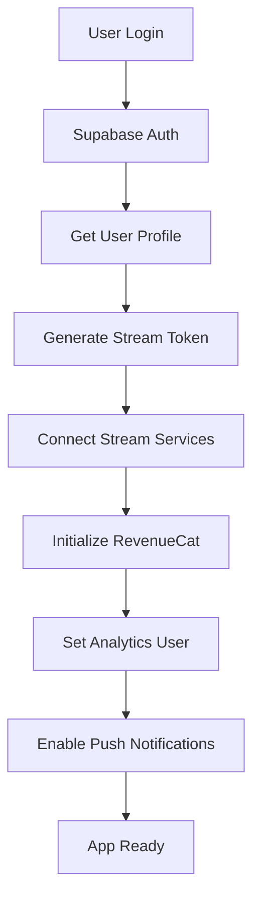

# Third-Party Integrations

## Overview
The travel platform leverages multiple third-party services to provide comprehensive functionality while maintaining performance, security, and user experience standards.

## Core Integrations

### 1. Supabase (Backend & Authentication)
**Purpose**: Database, Authentication, Real-time subscriptions, File storage

```typescript
// Configuration
interface SupabaseConfig {
  url: string;
  anonKey: string;
  serviceRoleKey?: string; // Server-side only
}

// Services Used:
// - PostgreSQL Database with PostGIS
// - Authentication (email, social, phone)
// - Real-time subscriptions
// - Storage for images/documents
// - Edge Functions for serverless logic
// - Row Level Security (RLS)

// Installation
npm install @supabase/supabase-js

// Setup
// src/services/supabase/client.ts
import { createClient } from '@supabase/supabase-js';
import { Database } from '@/types/database';

export const supabase = createClient<Database>(
  process.env.EXPO_PUBLIC_SUPABASE_URL!,
  process.env.EXPO_PUBLIC_SUPABASE_ANON_KEY!
);
```

**Features Enabled:**
- User authentication & profiles
- Listing management
- Booking system
- Real-time notifications
- File uploads (images, documents)
- Geographic queries (PostGIS)

### 2. Stream (Chat, Social, Video)
**Purpose**: In-app messaging, social feeds, voice/video calls

```typescript
// Configuration
interface StreamConfig {
  apiKey: string;
  secret?: string; // Server-side only
  chatAppId: string;
  feedsAppId: string;
  videoAppId: string;
}

// Services Used:
// - Stream Chat: 1-on-1 and group messaging
// - Stream Activity Feeds: Social posts and activities
// - Stream Video: Voice and video calls

// Installation
npm install stream-chat-expo stream-chat-react-native
npm install @stream-io/react-native-sdk
npm install @stream-io/video-react-native-sdk

// Setup
// src/services/stream/chat-client.ts
import { StreamChat } from 'stream-chat';
import { StreamVideoClient } from '@stream-io/video-react-native-sdk';

export const chatClient = StreamChat.getInstance(
  process.env.EXPO_PUBLIC_STREAM_API_KEY!
);

export const videoClient = new StreamVideoClient({
  apiKey: process.env.EXPO_PUBLIC_STREAM_API_KEY!,
  user: { id: userId },
  token: userToken,
});
```

**Features Enabled:**
- Real-time messaging between users
- Message threads and reactions
- File/image sharing in chat
- Voice and video calls
- Social activity feeds
- Push notifications for messages
- Online presence indicators

### 3. Stripe Connect (Marketplace Payments, Escrow & Payouts)
**Purpose**: Payment processing, escrow management, marketplace payouts, connected accounts

```typescript
// Configuration
interface StripeConfig {
  publishableKey: string;
  applicationFeePercent: number;
  currency: string;
  paymentMethods: string[];
}

// Installation
npm install @stripe/stripe-react-native stripe

// Setup
// src/services/stripe/client.ts
import { initStripe } from '@stripe/stripe-react-native';

export const initializeStripe = async () => {
  await initStripe({
    publishableKey: process.env.EXPO_PUBLIC_STRIPE_PUBLISHABLE_KEY!,
    merchantIdentifier: 'merchant.com.mynewtravelproject',
    urlScheme: 'mynewtravelproject',
  });
};

// Services
// src/services/stripe/index.ts
export {
  initializeStripe,
  createPaymentIntent,
  createConnectedAccount,
  createEscrow,
  createPayout,
} from './stripe';
```

**Features Enabled:**
- Payment intent creation with application fees (3% platform fee)
- Stripe Connect Express accounts for hosts
- Connected account onboarding and verification
- Escrow management with automatic release
- Scheduled payouts to hosts
- Refund processing
- Payment method management (cards, digital wallets)
- Webhook handling for payment events
- PCI compliance and security
- Multi-currency support
- Dispute management

**Database Tables:**
- `payments`: Payment transactions with Stripe payment intents
- `escrow`: Funds held in escrow during booking lifecycle
- `payouts`: Scheduled payouts to hosts
- `stripe_connected_accounts`: Host Stripe Connect account details

## Maps & Location Services

### 4. Expo Location & MapView
**Purpose**: Location services, maps, geolocation

```typescript
// Installation (part of Expo)
npx expo install expo-location react-native-maps

// Configuration
interface LocationConfig {
  accuracy: LocationAccuracy;
  enableBackgroundLocation: boolean;
  geofencing: boolean;
}

// Features Enabled:
// - Current user location
// - Address geocoding/reverse geocoding
// - Map display with custom markers
// - Route planning and directions
// - Geofencing for location-based notifications
```

### 5. Google Places API (Optional Enhancement)
**Purpose**: Enhanced location search, place details, autocomplete

```typescript
// Installation
npm install react-native-google-places-autocomplete

// Features:
// - Place autocomplete
// - Detailed place information
// - Nearby search
// - Place photos
```

## Image & Media Processing

### 6. Expo Image Picker & ImageManipulator
**Purpose**: Image capture, processing, optimization

```typescript
// Installation (part of Expo)
npx expo install expo-image-picker expo-image-manipulator

// Features:
// - Camera and gallery access
// - Image cropping and resizing
// - Format conversion
// - Compression for uploads
```

### 7. Expo AV (Audio/Video)
**Purpose**: Media playback for listing videos

```typescript
// Installation
npx expo install expo-av

// Features:
// - Video playback for listing tours
// - Audio playback for voice messages
// - Recording capabilities
```

## Communication & Notifications

### 8. Expo Notifications
**Purpose**: Push notifications

```typescript
// Installation
npx expo install expo-notifications

// Setup
// src/services/notifications/expo-notifications.ts
import * as Notifications from 'expo-notifications';

// Features:
// - Push notifications for bookings
// - Message notifications
// - Social interaction alerts
// - Marketing notifications
// - Local notifications for reminders
```

### 9. Email Service (Optional - SendGrid/Postmark)
**Purpose**: Transactional emails

```typescript
// Via Supabase Edge Functions or external API
// Features:
// - Booking confirmations
// - Password reset emails
// - Marketing emails
// - Receipt emails
```

## Analytics & Monitoring

### 10. Expo Analytics (Built-in)
**Purpose**: Basic app analytics

```typescript
// Built into Expo
// Features:
// - App usage tracking
// - Crash reporting
// - Performance monitoring
```

### 11. Sentry (Error Tracking)
**Purpose**: Error monitoring and performance tracking

```typescript
// Installation
npm install @sentry/react-native

// Setup
import * as Sentry from '@sentry/react-native';

Sentry.init({
  dsn: process.env.EXPO_PUBLIC_SENTRY_DSN,
});

// Features:
// - Real-time error tracking
// - Performance monitoring
// - Release tracking
// - User feedback collection
```

## Additional Services

### 12. Expo Secure Store
**Purpose**: Secure local storage

```typescript
// Installation (part of Expo)
npx expo install expo-secure-store

// Features:
// - Secure token storage
// - User credentials caching
// - Biometric authentication data
```

### 13. Expo Web Browser
**Purpose**: In-app browser for external links

```typescript
// Already included in project
// Features:
// - OAuth flows
// - External link handling
// - Terms of service/privacy policy
```

### 14. React Query (TanStack Query)
**Purpose**: Server state management and caching

```typescript
// Installation
npm install @tanstack/react-query

// Features:
// - API response caching
// - Background refetching
// - Optimistic updates
// - Infinite scrolling
// - Offline support
```

## Integration Architecture

### Service Layer Structure
```typescript
// src/services/index.ts
export { supabase } from './supabase/client';
export { chatClient, videoClient } from './stream/clients';
export { initializeRevenueCat } from './revenuecat/client';
export {
  initializeStripe,
  createPaymentIntent,
  createConnectedAccount,
  createEscrow,
  createPayout,
} from './stripe';
export { locationService } from './location/service';
export { notificationService } from './notifications/service';
export { analyticsService } from './analytics/service';

// Centralized service initialization
export const initializeServices = async (user: User) => {
  await Promise.all([
    initializeStripe(),
    initializeRevenueCat(),
    chatClient.connectUser(user, streamToken),
    notificationService.initialize(user.id),
    analyticsService.setUser(user),
  ]);
};
```

### Environment Configuration
```typescript
// app.config.ts
export default {
  expo: {
    extra: {
      // Supabase
      supabaseUrl: process.env.SUPABASE_URL,
      supabaseAnonKey: process.env.SUPABASE_ANON_KEY,

      // Stream
      streamApiKey: process.env.STREAM_API_KEY,

      // RevenueCat
      revenueCatIosKey: process.env.REVENUECAT_IOS_KEY,
      revenueCatAndroidKey: process.env.REVENUECAT_ANDROID_KEY,

      // Stripe
      stripePublishableKey: process.env.STRIPE_PUBLISHABLE_KEY,

      // Analytics
      sentryDsn: process.env.SENTRY_DSN,

      // Maps (if using Google Maps)
      googleMapsApiKey: process.env.GOOGLE_MAPS_API_KEY,
    },
  },
};
```

## Security Considerations

### API Key Management
- Use Expo's secure environment variables
- Never expose server-side keys in client code
- Implement key rotation strategies
- Use different keys for development/production

### Authentication Flow


### Data Flow Security
- All API calls go through authenticated endpoints
- Stream tokens are server-generated with appropriate permissions
- RevenueCat handles payment security
- Supabase RLS policies protect user data

## Cost Optimization Strategies

### Supabase
- Use read replicas for heavy read operations
- Implement connection pooling
- Optimize database queries
- Use Supabase Edge Functions for server logic

### Stream
- Implement message retention policies
- Use webhooks to sync data efficiently
- Optimize feed queries with pagination
- Cache frequently accessed data

### RevenueCat
- Monitor subscription metrics
- Implement proper trial periods
- Use webhook events for real-time updates
- Optimize paywall conversion rates

### General
- Implement proper caching strategies
- Use CDN for static assets
- Optimize image sizes and formats
- Implement lazy loading for components

## Testing Strategy

### Integration Testing
```typescript
// Mock services for testing
jest.mock('./services/supabase/client');
jest.mock('./services/stream/clients');
jest.mock('react-native-purchases');
jest.mock('@stripe/stripe-react-native');

// Test service integration
describe('Service Integration', () => {
  test('should initialize all services', async () => {
    const user = mockUser();
    await initializeServices(user);

    expect(chatClient.connectUser).toHaveBeenCalledWith(user, expect.any(String));
    expect(Purchases.logIn).toHaveBeenCalledWith(user.id);
  });

  test('should handle Stripe payment flow', async () => {
    const bookingId = 'booking-123';
    const amount = 10000; // $100.00

    // Mock payment intent creation
    const paymentIntent = await createPaymentIntent({
      bookingId,
      amount,
      connectedAccountId: 'acct_host123',
    });

    expect(paymentIntent.amount).toBe(amount);
    expect(paymentIntent.applicationFeeAmount).toBe(amount * 0.03); // 3% fee
  });
});
```

This integration architecture provides:
- **Comprehensive Functionality**: All required travel platform features
- **Scalable Architecture**: Services can be replaced or enhanced independently
- **Security First**: Proper authentication and data protection
- **Cost Effective**: Optimized usage of third-party services
- **Testable**: Mockable service layer for comprehensive testing
- **Maintainable**: Clear separation of concerns and centralized configuration